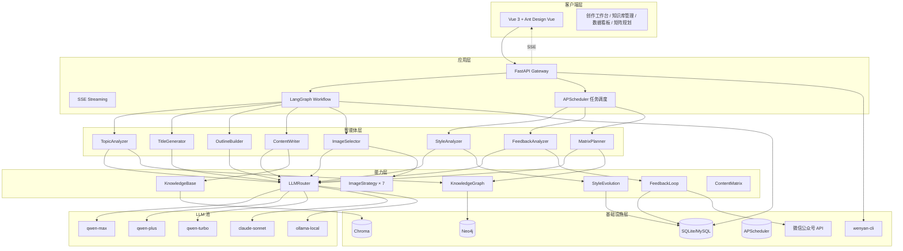
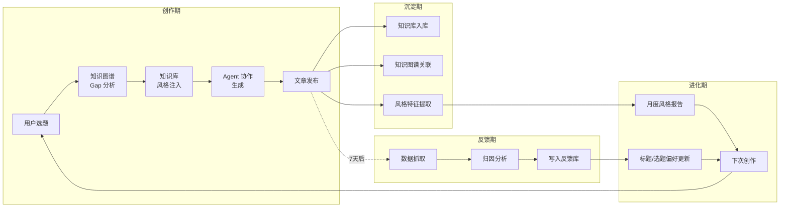
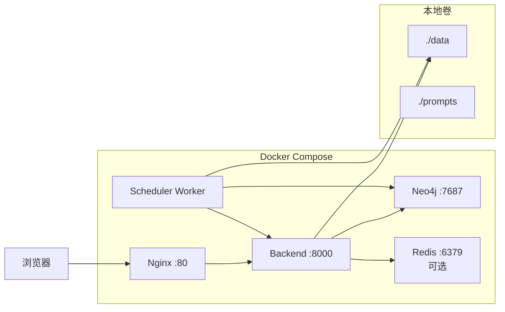
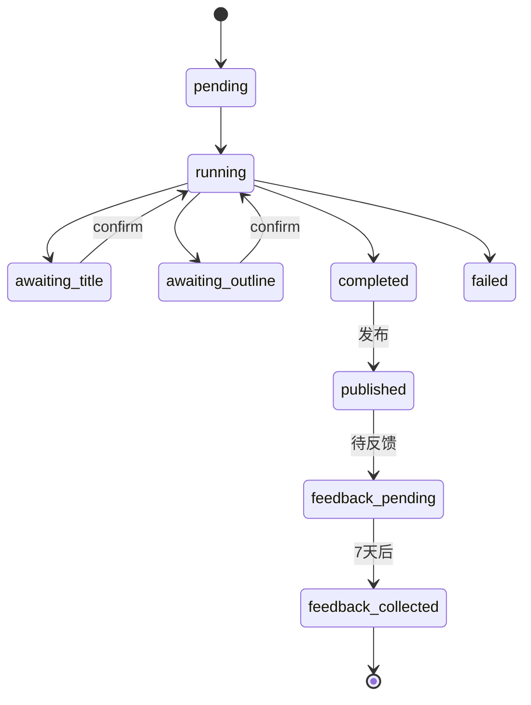
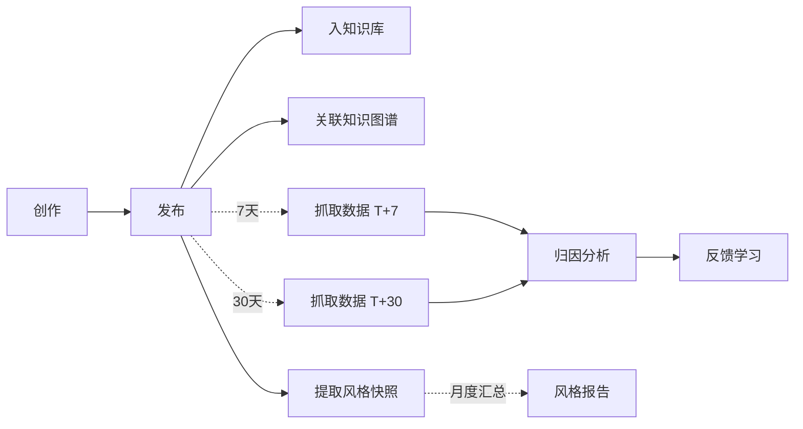
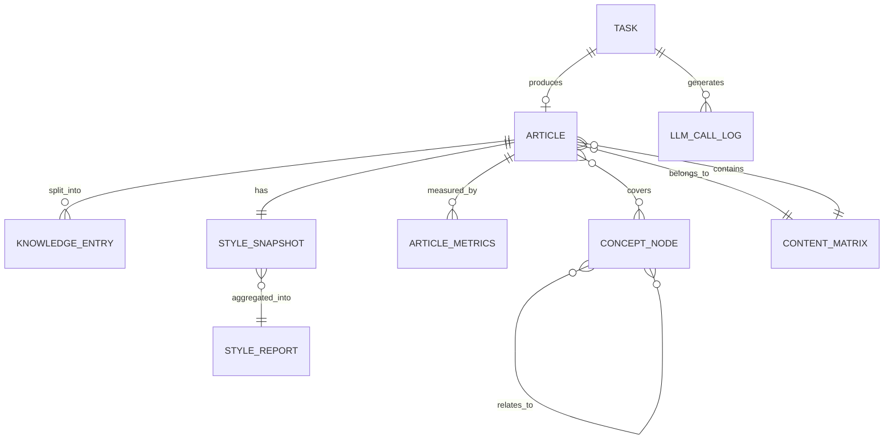
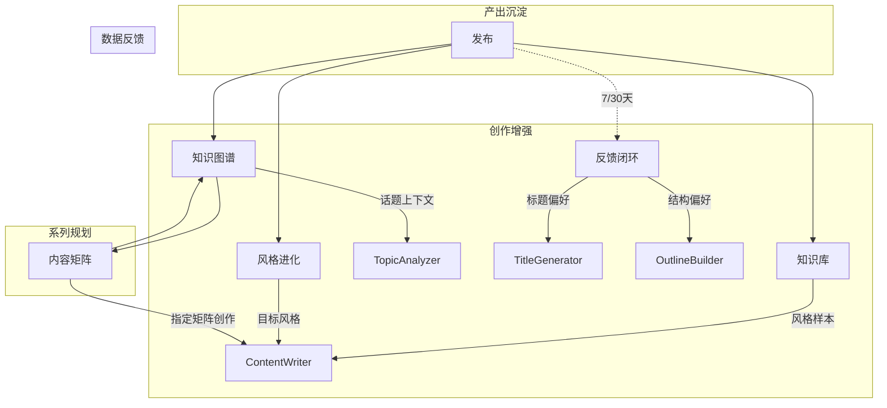
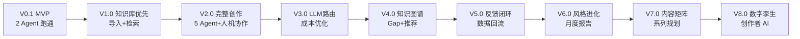

# AI 创作副驾驶（Creator Copilot）— 技术方案与开发指南

| 字段   | 值               |
|------|-----------------|
| 文档版本 | 1.0.0           |
| 项目代号 | creator-copilot |
| 作者   | 云淡风轻            |
| 创建日期 | 2026-04-16      |
| 更新日期 | 2026-04-17      |
| 评审状态 | Draft           |

---

## 目录

1. [项目概述](#1-项目概述)
2. [核心设计决策（ADR）](#2-核心设计决策adr)
3. [系统架构](#3-系统架构)
4. [领域模型](#4-领域模型)
5. [核心模块设计](#5-核心模块设计)
6. [接口设计](#6-接口设计)
7. [非功能性设计](#7-非功能性设计)
8. [项目结构与工程规范](#8-项目结构与工程规范)
9. [部署与运维](#9-部署与运维)
10. [演进路线图](#10-演进路线图)
11. [附录](#11-附录)

---

## 1. 项目概述

### 1.1 项目定位

**一个创作者的第二大脑 + 内容副驾驶。**

不是"AI 写文章工具"，而是帮助技术博主**沉淀知识资产、规划内容矩阵、优化创作策略、持续进化风格**的长期陪伴系统。

生成文章只是表象，真正的核心是**创作者数据资产的飞轮**：
- 写得越多 → 知识库越丰富 → AI 越懂你
- 发得越多 → 反馈数据越多 → AI 越懂读者
- 用得越久 → 风格越稳定 → 个人品牌越强

### 1.2 四大核心能力

| 能力 | 说明 |
|---|---|
| **智能创作** | 5 Agent 协作 + 人机协作 + SSE 流式，单篇文章高效产出 |
| **知识沉淀** | 知识库学习风格、知识图谱规划选题、历史文章资产化 |
| **风格进化追踪** | 持续监测创作风格漂移，给出进化报告，塑造个人品牌 |
| **内容矩阵规划** | 从单篇升级到系列，自动规划学习路径、引用网络、发布节奏 |
| **反馈闭环** | 发布后数据回流，AI 学习什么样的文章受欢迎 |
| **LLM 智能路由** | 不同任务自动选择不同模型，平衡质量、速度、成本 |

### 1.3 目标用户

- 技术博主、程序员（主用户）
- 长期运营公众号 / 知乎 / 掘金的内容创作者
- 希望把创作从"一次性劳动"变成"资产积累"的人

### 1.4 非目标

- ❌ 通用内容生成平台（聚焦技术类长文）
- ❌ 多人实时协作编辑（单创作者 + AI 副驾驶模式）
- ❌ 纯 AI 代写（人机协作是根基，不做"完全自动化")

### 1.5 产品哲学

> **"Augment, don't replace."**
> AI 的价值是放大创作者，而非替代创作者。

---

## 2. 核心设计决策（ADR）

### ADR-001：LangGraph 作为工作流编排引擎

**背景**：5 Agent 协作 + 两个人机暂停点。

**决策**：LangGraph。

**理由**：原生 interrupt + checkpoint，匹配人机协作与 SSE 断线恢复。

---

### ADR-002：SQLite 优先，MySQL 生产可选

**决策**：开发用 SQLite，并发 > 50 QPS 切换 MySQL。

**影响**：SQL 避免方言，抽象层兼容。

---

### ADR-003：SSE 而非 WebSocket

**决策**：SSE。

**理由**：单向推送场景、原生重连、实现简单。用户交互（确认）走独立 POST。

---

### ADR-004：Chroma（知识库）+ Neo4j（知识图谱）混合

**决策**：Chroma 嵌入式部署做向量检索，Neo4j 做图关系持久化，NetworkX 做图算法。

**影响**：双存储，但职责清晰，各自最优。

---

### ADR-005：LLM 智能路由层

**背景**：5 Agent 对模型能力需求差异巨大。简单任务用 qwen-max 浪费，复杂任务用 qwen-plus 质量不够。

**决策**：引入 **LLMRouter**，基于任务类型、成本预算、延迟要求动态选择模型。

**候选模型池**：
- qwen-plus（快、便宜，简单任务）
- qwen-max（质量高，复杂创作）
- qwen-turbo（超快，低延迟场景）
- claude-3.5-sonnet（可选，最终润色）
- 本地模型（Ollama，隐私敏感内容）

**路由策略**：
| 任务 | 默认模型 | 降级模型 |
|---|---|---|
| TopicAnalyzer | qwen-plus | qwen-turbo |
| TitleGenerator | qwen-max | qwen-plus |
| OutlineBuilder | qwen-max | qwen-plus |
| ContentWriter | qwen-max | claude-3.5-sonnet（可选） |
| ImageSelector | qwen-plus | qwen-turbo |
| StyleAnalyzer | qwen-plus | qwen-turbo |
| FeedbackAnalyzer | qwen-plus | qwen-turbo |

**影响**：
- 成本降低 40%（相比全用 qwen-max）
- 需要统一的 LLM 抽象层和模型配置管理
- 需要监控各模型的调用成本

---

### ADR-006：反馈闭环采用异步任务队列

**背景**：发布后需定时抓取公众号数据，不能影响主创作流程。

**决策**：用 **APScheduler**（轻量）或 **Celery + Redis**（生产级）异步执行数据抓取和归因分析。

**理由**：
- 数据抓取有延迟（发布后 7/30 天）
- 需要幂等、重试、失败告警
- 与主流程完全解耦

---

### ADR-007：风格进化追踪的采样策略

**背景**：每篇文章都做完整风格分析成本高。

**决策**：
- 发布即时：轻量风格特征提取（10+ 维度）
- 每月：跨文章对比分析，生成风格报告
- 每季度：风格漂移预警

**理由**：平衡计算成本和价值产出。

---

### ADR-008：内容矩阵规划采用"模板+图谱"双引擎

**决策**：
- 系列模板库（入门-进阶-实战-进阶-高级的通用模板）
- 知识图谱驱动的动态路径规划
- 用户可选"快速模板"或"深度规划"

**理由**：模板覆盖 80% 场景、图谱处理长尾需求。

---

## 3. 系统架构

### 3.1 逻辑架构（全景）



### 3.2 数据流全景



这是一个**闭环飞轮**：每篇文章都让下一篇更好。

### 3.3 部署架构



---

## 4. 领域模型

### 4.1 核心概念

| 概念 | 定义 | 生命周期 |
|---|---|---|
| **Task** | 一次创作任务 | 持久化 |
| **ArticleState** | 工作流共享状态 | 瞬态（可恢复） |
| **Article** | 文章实体 | 持久化 |
| **KnowledgeEntry** | 知识库条目 | 持久化 |
| **ConceptNode** | 知识图谱节点 | 持久化 |
| **StyleSnapshot** | 风格快照（单篇） | 持久化 |
| **StyleReport** | 风格进化报告（跨文章） | 持久化 |
| **ArticleMetrics** | 文章表现数据 | 持久化 |
| **ContentMatrix** | 内容矩阵（系列） | 持久化 |
| **LLMCallLog** | LLM 调用日志 | 持久化 |

### 4.2 Task 状态机



### 4.3 Article 生命周期



### 4.4 ER 图（核心部分）



---

## 5. 核心模块设计

### 5.1 工作流引擎（LangGraph）

#### 5.1.1 ArticleState

```python
class ArticleState(TypedDict):
    task_id: str
    topic: str
    matrix_id: Optional[str]     # 所属内容矩阵
    image_source: str

    # 创作产出
    analysis: Optional[dict]
    titles: list[TitleOption]
    selected_title_id: Optional[int]
    edited_title: Optional[str]
    outline: Optional[dict]
    edited_outline: Optional[dict]
    content: Optional[str]
    cover_image_url: Optional[str]

    # 增强上下文（注入 Prompt）
    style_context: Optional[str]         # 来自知识库
    graph_context: Optional[dict]        # 来自知识图谱
    feedback_hints: Optional[dict]       # 来自反馈闭环

    # 元数据
    current_node: str
    history: list[str]
```

#### 5.1.2 工作流拓扑

```
START
  │
  ▼
[context_enrich] ─► 知识库+图谱+反馈提示注入
  │
  ▼
analyze ─► title ─► [INTERRUPT: await_title]
                           │
                           ▼
                        outline ─► [INTERRUPT: await_outline]
                                          │
                                          ▼
                                        write ─► image ─► END
                                                    │
                                                    ▼
                                        [post_process] 异步触发
```

**`post_process` 包含**：
- 入知识库
- 关联知识图谱
- 提取风格快照
- 注册反馈回流任务（APScheduler）

---

### 5.2 智能体设计

#### 5.2.1 Agent 总览（扩展到 8 个）

| Agent | 触发时机 | 默认模型 | 说明 |
|---|---|---|---|
| TopicAnalyzer | 创作时 | qwen-plus | 选题分析 |
| TitleGenerator | 创作时 | qwen-max | 标题生成（参考反馈数据） |
| OutlineBuilder | 创作时 | qwen-max | 大纲构建 |
| ContentWriter | 创作时 | qwen-max | 正文（流式） |
| ImageSelector | 创作时 | qwen-plus | 配图 |
| **StyleAnalyzer** | 发布后 + 月度 | qwen-plus | 风格快照 + 进化报告 |
| **FeedbackAnalyzer** | T+7 / T+30 | qwen-plus | 数据归因分析 |
| **MatrixPlanner** | 按需 | qwen-max | 系列规划 |

#### 5.2.2 TitleGenerator 的反馈增强

**关键升级**：不再凭空生成，而是参考历史爆款标题特征。

```python
class TitleGeneratorAgent:
    async def generate(self, analysis: dict, feedback_hints: dict) -> list[TitleOption]:
        """
        feedback_hints 包含：
        - top_performing_patterns: 历史高阅读量标题的模式
        - low_performing_patterns: 历史低表现标题的特征
        - preferred_length: 历史最佳标题长度
        - preferred_style: 偏好风格（疑问/数字/大话题）
        """
        ...
```

---

### 5.3 LLM 智能路由（核心基础设施）

#### 5.3.1 设计目标

- **质量优先**：复杂任务用强模型
- **成本可控**：简单任务用便宜模型
- **可降级**：主模型失败时自动切换
- **可观测**：每次调用记录成本、延迟、质量

#### 5.3.2 LLMRouter 接口

```python
class LLMRouter:
    async def invoke(
        self,
        task_type: TaskType,
        prompt: str,
        constraints: LLMConstraints = None,
        stream: bool = False
    ) -> LLMResponse | AsyncIterator[str]: ...

@dataclass
class LLMConstraints:
    max_cost: Optional[float] = None        # 单次调用最大成本
    max_latency_ms: Optional[int] = None    # 最大延迟
    min_quality: Optional[str] = None       # "fast" / "balanced" / "best"
    prefer_model: Optional[str] = None      # 用户指定
    exclude_models: list[str] = None        # 排除某些模型

@dataclass
class LLMResponse:
    content: str
    model_used: str
    input_tokens: int
    output_tokens: int
    cost: float
    latency_ms: int
```

#### 5.3.3 路由决策矩阵

| TaskType | 质量要求 | 延迟要求 | 首选 | 降级 | 理由 |
|---|---|---|---|---|---|
| topic_analyze | balanced | < 3s | qwen-plus | qwen-turbo | 结构化简单任务 |
| title_generate | best | < 5s | qwen-max | qwen-plus | 创意要求高 |
| outline_build | best | < 5s | qwen-max | qwen-plus | 结构化复杂 |
| content_write | best | 流式 | qwen-max | claude-sonnet | 核心产出 |
| content_polish | best | 批量 | claude-sonnet | qwen-max | 润色需要不同视角 |
| style_analyze | balanced | 批量 | qwen-plus | qwen-turbo | 特征提取 |
| feedback_analyze | balanced | 批量 | qwen-plus | qwen-turbo | 数据分析 |
| matrix_plan | best | < 10s | qwen-max | qwen-plus | 规划复杂 |
| embedding | - | - | text-embedding-v2 | - | 专用模型 |

#### 5.3.4 降级策略

```
请求 → 首选模型
  ├─ 成功 → 返回
  ├─ 超时（> max_latency）→ 降级模型
  ├─ 限流（429）→ 等待后重试 1 次 → 降级
  ├─ 余额不足 → 降级 + 告警
  └─ 其他错误 → 重试 1 次 → 降级 → 抛错
```

#### 5.3.5 成本监控

```sql
CREATE TABLE llm_call_logs (
    id INTEGER PRIMARY KEY,
    task_id TEXT,
    agent_name TEXT,
    task_type TEXT,
    model_used TEXT,
    input_tokens INTEGER,
    output_tokens INTEGER,
    cost_cny REAL,
    latency_ms INTEGER,
    status TEXT,
    fallback_from TEXT,     -- 是否由降级而来
    created_at TIMESTAMP
);
```

---

### 5.4 配图策略（7 种）

（与 v3.0 相同，此处省略。详见 `backend/app/strategies/`）

策略工厂模式，支持：random、pexels、mermaid、iconify、emoji、svg、nanobanana。

---

### 5.5 知识库（Knowledge Base）

#### 5.5.1 职责

- 向量化存储历史文章
- 创作时检索风格样本
- 查重：防止选题重复
- 素材复用：历史代码示例、数据引用

#### 5.5.2 核心接口

| 方法 | 输入 | 输出 | 职责 |
|---|---|---|---|
| `add_article` | Article | None | 入库 + 向量化 |
| `retrieve` | query, top_k | list[RetrievalResult] | 语义检索 |
| `get_style_context` | topic, limit | str | Prompt 注入上下文 |
| `check_duplication` | topic, threshold | list[RetrievalResult] | 查重 |
| `find_reusable_snippets` | topic | list[Snippet] | 找可复用片段 |

---

### 5.6 知识图谱（Knowledge Graph）

#### 5.6.1 职责

- 概念网络构建
- 话题推荐、Gap 分析
- 学习路径规划
- **为内容矩阵提供结构化支撑**

#### 5.6.2 核心接口

| 方法 | 输入 | 输出 | 职责 |
|---|---|---|---|
| `add_concept` | ConceptNode, relations | None | 新增节点 |
| `get_topic_context` | topic, depth | dict | N 度邻居 |
| `find_topic_gaps` | category | list[dict] | Gap 分析 |
| `recommend_related_topics` | topic, existing | list[dict] | 推荐 |
| `plan_learning_path` | target, from_level | list[Concept] | 学习路径 |
| `find_prerequisites` | concept | list[Concept] | 前置知识 |
| `link_article_to_graph` | article_id, concepts | None | 建立覆盖关系 |

---

### 5.7 风格进化追踪（StyleEvolution）⭐ 新增

#### 5.7.1 为什么需要

创作者的风格会在无意识中漂移：
- 越写越啰嗦？还是越来越简洁？
- 越来越偏技术深度？还是越来越科普？
- 用词越来越同质化？
- 文章结构是否有套路化倾向？

**让创作者有意识地塑造风格，而不是被 AI 同质化。**

#### 5.7.2 风格特征维度（20+ 维）

```python
@dataclass
class StyleSnapshot:
    article_id: str
    snapshot_at: datetime

    # 句式特征
    avg_sentence_length: float       # 平均句长
    sentence_length_variance: float  # 句长方差
    question_ratio: float            # 疑问句比例
    exclamation_ratio: float         # 感叹句比例

    # 词汇特征
    vocabulary_richness: float       # 词汇丰富度（TTR）
    technical_term_density: float    # 技术词密度
    colloquial_ratio: float          # 口语化程度
    frequent_words: list[str]        # Top 20 高频词
    signature_phrases: list[str]     # 标志性口头禅

    # 结构特征
    section_count: int               # 章节数
    avg_section_length: int          # 平均章节长度
    has_code_blocks: bool
    code_block_ratio: float          # 代码占比
    image_count: int

    # 语气特征
    formality_level: float           # 正式程度 0-1
    emotional_tone: str              # 情绪基调
    pov: str                         # 人称（第一/第二/第三）

    # 内容特征
    abstraction_level: float         # 抽象度（理论 vs 实战）
    technical_depth: float           # 技术深度
```

#### 5.7.3 风格报告（StyleReport）

```python
@dataclass
class StyleReport:
    period: str                      # "2026-04" / "2026-Q2"
    article_count: int

    # 趋势分析
    sentence_length_trend: Trend     # 升/降/稳定
    vocabulary_trend: Trend
    technical_depth_trend: Trend

    # 漂移预警
    drift_alerts: list[DriftAlert]   # 显著偏离历史基线的维度

    # 对比分析
    vs_last_period: Comparison       # 与上月/上季对比
    vs_baseline: Comparison          # 与基线（前 10 篇平均）对比

    # 建议
    suggestions: list[str]           # "建议缩短句长" / "技术词密度上升过快"
```

#### 5.7.4 触发时机

| 触发 | 操作 |
|---|---|
| 文章发布后立即 | 生成 StyleSnapshot |
| 每月 1 号 | 生成月度 StyleReport |
| 每季度末 | 生成季度 StyleReport + 漂移预警 |
| 用户手动触发 | 立即对比分析 |

#### 5.7.5 StyleAnalyzer Agent

```python
class StyleAnalyzerAgent:
    async def snapshot(self, article: Article) -> StyleSnapshot: ...
    async def report(self, period: str) -> StyleReport: ...
    async def detect_drift(self, current: StyleSnapshot, baseline: list[StyleSnapshot]) -> list[DriftAlert]: ...
```

#### 5.7.6 与创作的协同

- 创作前：把"用户期望风格"注入 ContentWriter 的 Prompt
- 创作后：立即对比本次产出与历史基线，如果漂移显著，给用户提示
- 长期：月度报告推送到前端 Dashboard

---

### 5.8 内容矩阵规划（ContentMatrix）⭐ 新增

#### 5.8.1 为什么需要

单篇文章是战术，系列内容是战略。真正有影响力的技术博主都在做**系列内容**：
- 《深入 React 源码》15 篇
- 《算法图解》30 篇
- 《LangGraph 从入门到精通》8 篇

手工规划系列非常耗时。知识图谱 + AI 可以自动完成。

#### 5.8.2 数据模型

```python
@dataclass
class ContentMatrix:
    id: str
    name: str                        # "LangGraph 从入门到精通"
    description: str
    target_audience: str
    difficulty_range: tuple[int, int]  # (1, 5)

    theme_concept: str               # 核心概念（图谱节点）
    related_concepts: list[str]      # 相关概念

    articles: list[MatrixArticle]    # 规划的文章列表
    publishing_schedule: Schedule    # 发布节奏

    status: str                      # planning / executing / completed
    progress: float                  # 完成度 0-1

    created_at: datetime
    updated_at: datetime

@dataclass
class MatrixArticle:
    order: int                       # 在系列中的顺序
    proposed_title: str
    proposed_outline: dict
    covered_concepts: list[str]
    prerequisites: list[str]         # 依赖哪些概念（已写过 or 待写）
    difficulty: int
    estimated_words: int

    status: str                      # planned / drafting / published
    article_id: Optional[str]        # 真正写完后关联

    planned_publish_date: Optional[date]
```

#### 5.8.3 MatrixPlanner Agent

```python
class MatrixPlannerAgent:
    async def plan_from_theme(
        self,
        theme: str,                  # "LangGraph 入门到精通"
        target_audience: str,
        article_count: int = 8,
        difficulty_range: tuple = (1, 5)
    ) -> ContentMatrix:
        """
        1. 在知识图谱中找到 theme 对应的核心概念
        2. 找出相关概念子图
        3. 按难度和依赖关系排序
        4. 分配到 N 篇文章
        5. 生成每篇的标题、大纲、发布建议
        """
        ...

    async def plan_from_concepts(
        self,
        concepts: list[str],
        ordering: Literal["difficulty", "dependency", "popularity"] = "dependency"
    ) -> ContentMatrix: ...

    async def optimize_order(
        self,
        matrix: ContentMatrix
    ) -> ContentMatrix:
        """基于读者学习路径优化文章顺序"""
        ...

    async def suggest_publishing_schedule(
        self,
        matrix: ContentMatrix,
        start_date: date,
        frequency: Literal["weekly", "biweekly", "monthly"]
    ) -> Schedule: ...
```

#### 5.8.4 矩阵内引用网络

创作矩阵中的文章时，AI 自动：
- 识别前置知识 → "建议先阅读本系列的第 X 篇"
- 识别后续内容 → "下一篇我们将探讨..."
- 建立引用网络 → 读者可跳转浏览

#### 5.8.5 发布节奏建议

```python
@dataclass
class Schedule:
    frequency: str                   # weekly / biweekly
    best_day_of_week: str            # "周三"（基于历史数据）
    best_hour: int                   # 9（基于历史数据）
    articles: list[ScheduleEntry]
```

节奏建议基于**反馈闭环**的历史数据。

#### 5.8.6 工作台界面（Dashboard）

```
┌─────────────────────────────────────────┐
│ 我的内容矩阵                             │
├─────────────────────────────────────────┤
│ 📚 LangGraph 从入门到精通 (3/8)         │
│    [■■■□□□□□] 37%                      │
│    下一篇：State 与 Checkpoint          │
│    建议发布：周三 9:00                   │
│                                         │
│ 📚 Python 异步编程系列 (已完成)         │
│    [■■■■■■■■] 100%                     │
└─────────────────────────────────────────┘
```

---

### 5.9 反馈闭环（FeedbackLoop）⭐ 新增

#### 5.9.1 为什么需要

AI 生成的文章表现如何？好在哪？差在哪？

传统做法：创作者凭感觉。
我们的做法：**数据驱动的持续学习**。

#### 5.9.2 数据采集

```python
@dataclass
class ArticleMetrics:
    article_id: str
    collected_at: datetime
    days_since_publish: int          # 7 / 30

    # 基础数据
    views: int
    unique_readers: int
    completion_rate: float           # 完读率
    avg_read_time: int               # 平均阅读时长

    # 互动数据
    likes: int                       # 点赞
    wow_count: int                   # 在看
    shares: int                      # 转发
    comments: int
    favorites: int                   # 收藏

    # 增长数据
    new_followers: int               # 带来的新粉丝

    # 计算指标
    engagement_rate: float           # 互动率
    viral_coefficient: float         # 传播系数
    quality_score: float             # 综合质量分（0-100）
```

#### 5.9.3 采集时机

| 时间点 | 采集内容 | 说明 |
|---|---|---|
| T+1 day | 基础阅读数据 | 首日表现 |
| T+7 days | 完整数据 | 主要分析时点 |
| T+30 days | 长尾数据 | 评估长期价值 |

采集通过 APScheduler 定时任务，调用微信公众号官方 API。

#### 5.9.4 FeedbackAnalyzer Agent

```python
class FeedbackAnalyzerAgent:
    async def analyze_single(
        self,
        article: Article,
        metrics: ArticleMetrics
    ) -> FeedbackInsight:
        """
        单篇归因分析：
        - 这篇表现如何（分位数）
        - 亮点：什么因素带来了高表现
        - 问题：什么因素拖累了表现
        - 可借鉴之处
        """
        ...

    async def analyze_patterns(
        self,
        articles: list[Article],
        metrics: list[ArticleMetrics]
    ) -> PatternReport:
        """
        跨文章模式分析：
        - 爆款标题的共同特征
        - 高完读率文章的结构特征
        - 最佳发布时间
        - 读者偏好的话题
        """
        ...
```

#### 5.9.5 归因分析维度

对每篇文章，分析以下因素与表现的相关性：

| 维度 | 分析内容 |
|---|---|
| 标题 | 长度、句式、关键词、情绪 |
| 话题 | 热度、难度、新颖度 |
| 结构 | 章节数、段落长度、开头方式 |
| 风格 | 正式度、技术深度、叙事比例 |
| 发布时间 | 星期、小时 |
| 配图 | 策略、数量、位置 |
| 字数 | 总字数区间 |

#### 5.9.6 反哺创作的机制

创作下一篇文章时：

```python
# TitleGenerator 增强
feedback_hints = feedback_loop.get_title_hints()
# {
#   "top_patterns": ["数字列标题", "疑问句式"],
#   "avoid_patterns": ["过长标题"],
#   "best_length": 18,
#   "best_emotion": "好奇"
# }

# OutlineBuilder 增强
structure_hints = feedback_loop.get_structure_hints()
# {
#   "best_section_count": 5,
#   "best_opening_type": "故事开头",
#   "recommended_word_count": 2000-2500
# }

# 发布调度增强
schedule_hints = feedback_loop.get_schedule_hints()
# {
#   "best_day": "周三",
#   "best_hour": 9
# }
```

#### 5.9.7 数据看板

```
┌──────────────────────────────────────────┐
│ 📊 创作数据看板                          │
├──────────────────────────────────────────┤
│ 本月 8 篇 | 平均阅读 3.2k | 互动率 4.5%  │
│                                          │
│ 🏆 本月爆款 TOP 3                        │
│ 1. 《XXX》阅读 8.5k, 互动率 8.2%        │
│ 2. 《YYY》...                            │
│                                          │
│ 💡 AI 洞察                               │
│ • 你的疑问句标题比陈述句标题平均高 35%   │
│ • 周三早 9 点发布的文章首日阅读高 20%    │
│ • 含代码示例的文章完读率高 15%           │
└──────────────────────────────────────────┘
```

---

### 5.10 模块间协同全景



---

## 6. 接口设计

### 6.1 API 总览

#### 6.1.1 创作类

| Method | Path | 说明 |
|---|---|---|
| POST | /api/v1/article/stream | 创建任务（SSE） |
| POST | /api/v1/article/confirm-title | 确认标题 |
| POST | /api/v1/article/confirm-outline | 确认大纲 |
| POST | /api/v1/article/cancel | 取消任务 |
| GET | /api/v1/task/{task_id} | 任务详情 |
| GET | /api/v1/task/{task_id}/resume | 恢复 SSE |

#### 6.1.2 知识资产类

| Method | Path | 说明 |
|---|---|---|
| POST | /api/v1/knowledge/articles | 导入历史文章 |
| POST | /api/v1/knowledge/articles/batch | 批量导入 |
| GET | /api/v1/knowledge/search | 语义检索 |
| POST | /api/v1/graph/concepts | 新增概念 |
| GET | /api/v1/graph/gaps | Gap 分析 |
| GET | /api/v1/graph/recommendations | 话题推荐 |
| GET | /api/v1/graph/learning-path | 学习路径 |

#### 6.1.3 风格进化类 ⭐

| Method | Path | 说明 |
|---|---|---|
| GET | /api/v1/style/snapshot/{article_id} | 单篇风格快照 |
| GET | /api/v1/style/report | 风格报告（月/季） |
| GET | /api/v1/style/drift-alerts | 漂移预警 |
| POST | /api/v1/style/baseline | 设置风格基线 |

#### 6.1.4 内容矩阵类 ⭐

| Method | Path | 说明 |
|---|---|---|
| POST | /api/v1/matrix | 创建矩阵 |
| POST | /api/v1/matrix/plan | AI 自动规划 |
| GET | /api/v1/matrix/{id} | 矩阵详情 |
| PUT | /api/v1/matrix/{id}/articles/{order} | 修改单篇规划 |
| POST | /api/v1/matrix/{id}/articles/{order}/create | 基于规划创作 |
| GET | /api/v1/matrix/{id}/schedule | 发布节奏 |

#### 6.1.5 反馈数据类 ⭐

| Method | Path | 说明 |
|---|---|---|
| GET | /api/v1/metrics/{article_id} | 文章数据 |
| POST | /api/v1/metrics/sync | 手动同步数据 |
| GET | /api/v1/feedback/insights/{article_id} | 归因分析 |
| GET | /api/v1/feedback/patterns | 模式洞察 |
| GET | /api/v1/feedback/dashboard | 数据看板 |

#### 6.1.6 LLM 与运维类

| Method | Path | 说明 |
|---|---|---|
| GET | /api/v1/llm/usage | LLM 调用统计 |
| GET | /api/v1/llm/costs | 成本报表 |
| POST | /api/v1/llm/route/test | 路由测试 |
| GET | /api/v1/stats | 系统统计 |

### 6.2 SSE 事件协议

| event | data | 说明 |
|---|---|---|
| start | `{task_id, topic}` | 任务开始 |
| context_enriched | `{style, graph, feedback}` | 上下文增强完成 |
| stage | `{node, data}` | 节点完成 |
| user_action | `{stage, action, data}` | 等待用户 |
| content | `{chunk, progress}` | 正文流式 |
| post_process | `{actions}` | 发布后异步任务注册 |
| done | `{draft}` | 完成 |
| error | `{code, message}` | 异常 |

### 6.3 统一响应格式

**成功**：
```json
{ "code": 0, "data": {...}, "message": "ok", "trace_id": "..." }
```

**失败**：
```json
{ "code": 4001, "data": null, "message": "...", "trace_id": "..." }
```

---

## 7. 非功能性设计

### 7.1 性能指标（SLO）

| 指标 | 目标 | 测量 |
|---|---|---|
| analyze 首响应 | < 3s | SSE start→stage |
| 正文首 token | < 5s | confirm→content |
| 端到端完成 | < 60s | 不含用户思考 |
| 知识库检索 | < 500ms | P99 |
| 图谱查询 | < 800ms | P99 |
| 并发 SSE | ≥ 50 | 压测 |
| 反馈抓取 | 24h 内完成当日 | 定时任务 |

### 7.2 成本控制

**单篇成本（含所有增强）**：

| 环节 | 模型 | 成本 |
|---|---|---|
| context_enrich（KB+KG+FL） | qwen-plus + embedding | ¥0.02 |
| analyze | qwen-plus | ¥0.004 |
| title | qwen-max | ¥0.06 |
| outline | qwen-max | ¥0.08 |
| write | qwen-max | ¥0.30 |
| image select | qwen-plus | ¥0.002 |
| post_process | qwen-plus | ¥0.01 |
| T+7 feedback | qwen-plus | ¥0.005 |
| 月度风格报告 | qwen-plus | ¥0.05/月 |
| **单篇总成本** | | **≈ ¥0.48** |

LLM 路由优化后相比全量 qwen-max 节省 **~35%**。

### 7.3 错误处理

| 场景 | 策略 |
|---|---|
| LLM 失败 | 路由降级 + 重试 1 次 |
| JSON 解析失败 | 降 temperature 重试 |
| SSE 断连 | checkpoint 恢复 |
| 反馈抓取失败 | 延迟重试（1h / 6h / 24h） |
| 微信 API 限流 | 队列暂停 + 告警 |
| 风格分析异常 | 跳过，不影响主流程 |

### 7.4 可观测性

#### 核心监控指标

- **创作域**：任务总数、成功率、平均耗时
- **Agent 域**：各 Agent P50/P99、失败率
- **LLM 域**：各模型调用量、成本、降级次数
- **知识域**：KB 条目数、KG 节点数、检索 QPS
- **反馈域**：数据抓取成功率、归因延迟
- **风格域**：漂移预警触发次数

#### 日志表

```sql
-- 通用执行日志
CREATE TABLE agent_executions (...);

-- LLM 调用日志
CREATE TABLE llm_call_logs (...);

-- 定时任务日志
CREATE TABLE scheduled_jobs (
    id INTEGER PRIMARY KEY,
    job_type TEXT,      -- feedback_t7 / feedback_t30 / style_report
    target_id TEXT,
    scheduled_at TIMESTAMP,
    executed_at TIMESTAMP,
    status TEXT,
    retry_count INTEGER,
    error TEXT
);
```

### 7.5 安全

| 维度 | 措施 |
|---|---|
| API Key | 环境变量 + 加密存储 |
| 微信 Secret | AES-256 加密 |
| Prompt 注入 | 输入限长 + 关键字过滤 |
| 反馈数据隐私 | 不上传到 LLM 原始读者数据 |
| 本地模型兜底 | 隐私敏感内容用 Ollama |

### 7.6 数据生命周期

| 数据类型 | 保留策略 |
|---|---|
| Task 执行日志 | 90 天 |
| LLM 调用日志 | 180 天 |
| 文章数据（永久） | 不删除 |
| 风格快照 | 永久 |
| 风格报告 | 永久 |
| 文章 metrics | 永久（用于长期学习） |

---

## 8. 项目结构与工程规范

### 8.1 目录结构

```
ai-writer/
├── backend/
│   ├── app/
│   │   ├── main.py
│   │   ├── config.py
│   │   ├── api/
│   │   │   ├── article.py
│   │   │   ├── knowledge.py
│   │   │   ├── graph.py
│   │   │   ├── style.py            # ⭐ 新增
│   │   │   ├── matrix.py           # ⭐ 新增
│   │   │   ├── feedback.py         # ⭐ 新增
│   │   │   ├── llm.py              # ⭐ 新增
│   │   │   └── deps.py
│   │   ├── workflow/
│   │   │   ├── state.py
│   │   │   ├── nodes.py
│   │   │   ├── edges.py
│   │   │   └── graph.py
│   │   ├── agents/
│   │   │   ├── base.py
│   │   │   ├── topic_analyzer.py
│   │   │   ├── title_generator.py
│   │   │   ├── outline_builder.py
│   │   │   ├── content_writer.py
│   │   │   ├── image_selector.py
│   │   │   ├── style_analyzer.py   # ⭐ 新增
│   │   │   ├── feedback_analyzer.py # ⭐ 新增
│   │   │   └── matrix_planner.py   # ⭐ 新增
│   │   ├── llm/                    # ⭐ 新增
│   │   │   ├── router.py
│   │   │   ├── providers/
│   │   │   │   ├── dashscope.py
│   │   │   │   ├── claude.py
│   │   │   │   └── ollama.py
│   │   │   ├── cost.py
│   │   │   └── fallback.py
│   │   ├── strategies/
│   │   ├── knowledge/
│   │   ├── graph/
│   │   ├── style/                  # ⭐ 新增
│   │   │   ├── analyzer.py
│   │   │   ├── features.py
│   │   │   └── drift.py
│   │   ├── matrix/                 # ⭐ 新增
│   │   │   ├── planner.py
│   │   │   ├── templates.py
│   │   │   └── scheduler.py
│   │   ├── feedback/               # ⭐ 新增
│   │   │   ├── collector.py
│   │   │   ├── wechat_api.py
│   │   │   ├── attribution.py
│   │   │   └── patterns.py
│   │   ├── scheduler/              # ⭐ 新增
│   │   │   ├── jobs.py
│   │   │   └── queue.py
│   │   ├── models/
│   │   ├── services/
│   │   └── utils/
│   ├── prompts/
│   ├── tests/
│   ├── requirements.txt
│   └── Dockerfile
├── frontend/
│   ├── src/
│   │   ├── views/
│   │   │   ├── Editor.vue          # 创作工作台
│   │   │   ├── Knowledge.vue       # 知识库管理
│   │   │   ├── Matrix.vue          # ⭐ 内容矩阵
│   │   │   ├── StyleReport.vue     # ⭐ 风格报告
│   │   │   └── Dashboard.vue       # ⭐ 数据看板
│   │   └── ...
│   └── ...
├── data/
├── docs/
├── docker-compose.yml
├── .env.example
└── README.md
```

### 8.2 代码规范

- Python：PEP 8 + 类型提示 + ruff
- 模块：Python ≤ 300 行，Vue ≤ 500 行
- 异步：I/O 全 async/await
- 错误：Agent 不抛未捕获异常
- 提交：conventional commits

### 8.3 测试规范

| 层级 | 工具 | 覆盖率 |
|---|---|---|
| 单元 | pytest + pytest-asyncio | ≥ 80% |
| 集成 | pytest + httpx | 主流程 100% |
| E2E | Playwright | 冒烟 |

LLM 必须 mock。

---

## 9. 部署与运维

### 9.1 环境变量

```bash
# LLM
DASHSCOPE_API_KEY=
ANTHROPIC_API_KEY=
OLLAMA_BASE_URL=http://localhost:11434

# 存储
DATABASE_URL=sqlite:///./data/app.db
CHROMA_PATH=./data/chroma
NEO4J_URI=bolt://neo4j:7687
NEO4J_PASSWORD=

# 公众号
WECHAT_APP_ID=
WECHAT_APP_SECRET=

# 调度
SCHEDULER_ENABLED=true
FEEDBACK_SYNC_INTERVAL_HOURS=6

# 成本
DAILY_COST_LIMIT_CNY=50.0
USER_DAILY_TASK_LIMIT=20

# 配图
PEXELS_API_KEY=
MINIMAX_API_KEY=
```

### 9.2 Docker Compose

```yaml
version: '3.8'
services:
  backend:
    build: ./backend
    ports: ["8000:8000"]
    env_file: .env
    volumes:
      - ./data:/app/data
      - ./backend/prompts:/app/prompts
    depends_on: [neo4j]

  scheduler:
    build: ./backend
    command: python -m app.scheduler.worker
    env_file: .env
    volumes:
      - ./data:/app/data
    depends_on: [backend, neo4j]

  frontend:
    build: ./frontend
    ports: ["3000:80"]

  neo4j:
    image: neo4j:5-community
    ports: ["7474:7474", "7687:7687"]
    environment:
      NEO4J_AUTH: neo4j/${NEO4J_PASSWORD}
    volumes:
      - ./data/neo4j:/data
```

### 9.3 服务器规格

| 场景 | CPU | 内存 | 磁盘 |
|---|---|---|---|
| MVP 单机 | 2 核 | 4 GB | 20 GB |
| 完整版（含 Neo4j+Scheduler） | 4 核 | 8 GB | 50 GB |
| 多用户 | 8 核 | 16 GB | 100 GB |

### 9.4 备份

| 数据 | 频率 | 方式 |
|---|---|---|
| SQLite | 每日 | 文件快照 |
| Chroma | 每日 | 目录归档 |
| Neo4j | 每周 | neo4j-admin dump |
| 文章原文 | 实时 | Git 版本化（可选） |

---

## 10. 演进路线图

### 10.1 阶段依赖



### 10.2 版本清单

#### V0.1 MVP（2 周）
- Title + Writer 两 Agent
- SSE 流式
- 单页面工作台

#### V1.0 知识库优先（3 周）⚡ 战略调整
- **文章导入工具（批量/单篇）**
- Chroma 集成
- 语义检索
- **风格样本注入 Prompt**
- 从 day 1 建立数据护城河

#### V2.0 完整创作（3 周）
- 5 Agent + LangGraph
- 三阶段人机协作
- interrupt/checkpoint
- 7 种配图策略

#### V3.0 LLM 路由（2 周）
- LLMRouter 实现
- 多模型支持
- 成本监控
- 降级策略

#### V4.0 知识图谱（3 周）
- Neo4j 集成
- 概念导入
- Gap 分析
- 话题推荐

#### V5.0 反馈闭环（3 周）
- 微信公众号 API 对接
- APScheduler 定时抓取
- 归因分析
- 数据看板

#### V6.0 风格进化（2 周）
- StyleSnapshot 提取
- 月度报告
- 漂移预警
- 风格对比看板

#### V7.0 内容矩阵（3 周）
- MatrixPlanner
- 系列模板库
- 图谱驱动规划
- 发布节奏建议

#### V8.0 数字孪生（未来）
- 创作者 AI 对话
- 自动回复读者评论
- 对外知识 API
- 创作者社交图谱

### 10.3 准入指标

| 版本 | 关键指标 |
|---|---|
| V1 | 导入 20+ 篇历史文章，风格样本可检索 |
| V2 | 端到端完成率 ≥ 90% |
| V3 | LLM 成本下降 ≥ 30% |
| V4 | Gap 推荐采纳率 ≥ 30% |
| V5 | 反馈数据采集成功率 ≥ 95% |
| V6 | 风格报告用户满意度 ≥ 7/10 |
| V7 | 矩阵规划被采纳率 ≥ 50% |

---

## 11. 附录

### A. 数据字典

#### tasks 表
| 字段 | 类型 | 说明 |
|---|---|---|
| id | TEXT PK | UUID |
| topic | TEXT | 选题 |
| matrix_id | TEXT | 所属矩阵 |
| status | TEXT | 状态 |
| created_at | TIMESTAMP | - |

#### articles 表
| 字段 | 类型 | 说明 |
|---|---|---|
| id | TEXT PK | - |
| task_id | TEXT FK | - |
| title | TEXT | - |
| content | TEXT | - |
| matrix_id | TEXT | 所属矩阵 |
| matrix_order | INTEGER | 矩阵中顺序 |
| published_at | TIMESTAMP | - |
| wechat_msg_id | TEXT | 公众号消息 ID |

#### style_snapshots 表
| 字段 | 类型 | 说明 |
|---|---|---|
| id | INTEGER PK | - |
| article_id | TEXT FK | - |
| features_json | JSON | 20+ 维特征 |
| created_at | TIMESTAMP | - |

#### article_metrics 表
| 字段 | 类型 | 说明 |
|---|---|---|
| id | INTEGER PK | - |
| article_id | TEXT FK | - |
| days_since_publish | INTEGER | 7/30 |
| views | INTEGER | - |
| likes | INTEGER | - |
| shares | INTEGER | - |
| completion_rate | REAL | - |
| quality_score | REAL | 综合分 |
| collected_at | TIMESTAMP | - |

#### content_matrices 表
| 字段 | 类型 | 说明 |
|---|---|---|
| id | TEXT PK | - |
| name | TEXT | - |
| theme_concept | TEXT | 核心概念 |
| status | TEXT | planning/executing/completed |
| articles_json | JSON | 规划文章列表 |

#### llm_call_logs 表
见 [5.3.5](#535-成本监控)。

### B. Prompt 模板

路径：`backend/prompts/`
- `topic_analyzer.md`
- `title_generator.md`（含反馈提示）
- `outline_builder.md`
- `content_writer.md`（含风格注入）
- `image_selector.md`
- `style_analyzer.md`
- `feedback_analyzer.md`
- `matrix_planner.md`

### C. 术语表

| 术语 | 定义 |
|---|---|
| Agent | 业务层智能体（8 个） |
| Node | LangGraph 节点 |
| LLMRouter | 多模型智能路由 |
| StyleSnapshot | 单篇风格快照 |
| StyleReport | 跨文章风格报告 |
| ArticleMetrics | 文章表现数据 |
| ContentMatrix | 内容矩阵（系列） |
| FeedbackLoop | 反馈闭环 |
| Drift | 风格漂移 |
| Attribution | 归因分析 |

### D. 参考资料

- [LangGraph](<https://langchain-ai.github.io/langgraph/>)
- [APScheduler](<https://apscheduler.readthedocs.io/>)
- [微信公众号数据分析接口](<https://developers.weixin.qq.com/doc/offiaccount/Analytics/>)
- [Chroma](<https://docs.trychroma.com/>)
- [Neo4j Cypher](<https://neo4j.com/docs/cypher-manual/>)
- [TTR 词汇丰富度](<https://en.wikipedia.org/wiki/Lexical_density>)

### E. 变更日志

| 版本 | 日期 | 变更 |
|---|---|---|
| 4.0.0 | 2026-04-17 | **重大升级**：新增风格进化追踪、内容矩阵规划、反馈闭环、LLM 智能路由四大模块；战略调整路线图（知识库前置到 V1） |
| 3.0.0 | 2026-04-17 | 重构：ADR + 非功能性设计 + Mermaid |
| 2.1.0 | 2026-04-16 | 知识库 + 知识图谱 |
| 2.0.0 | 2026-04-10 | LangGraph |
| 1.0.0 | 2026-04-01 | 初版 |

---

**文档维护约定**：涉及接口契约、ADR、数据模型变更时，必须同步更新本文档并升级版本号。