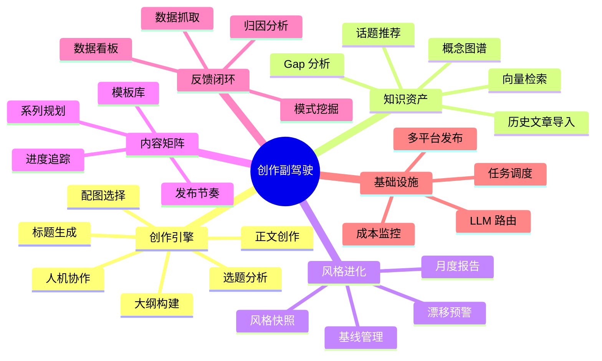
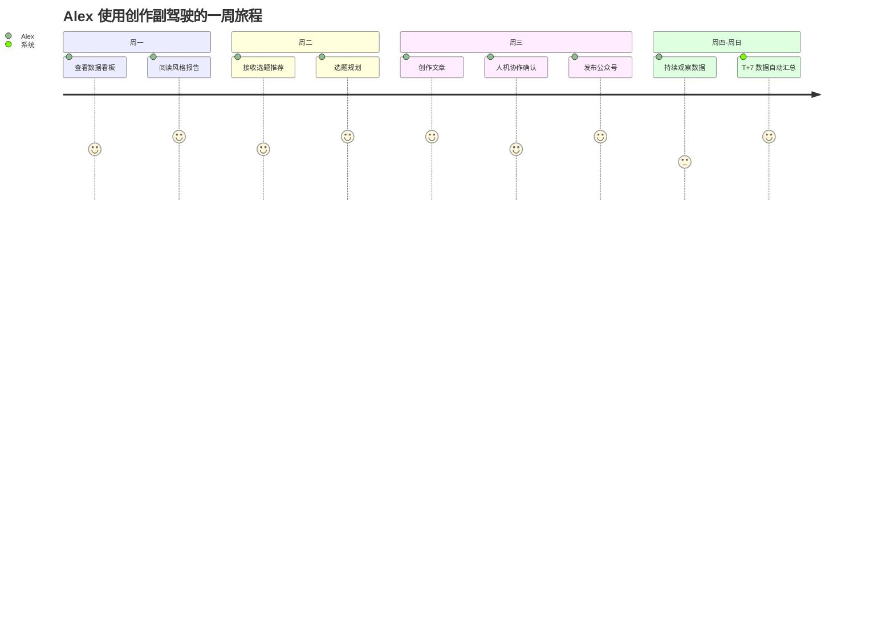

# AI 创作副驾驶（Creator Copilot）— 需求设计与开发计划文档

| 字段     | 值            |
|--------|--------------|
| 文档版本   | 1.0.0        |
| 对应技术方案 | v1.0.0       |
| 作者     | 云淡风轻         |
| 创建日期   | 2026-04-17   |
| 开发模式   | TDD（测试驱动开发）  |
| 团队规模假设 | 1人全栈         |

---

## 目录

1. [文档说明](#1-文档说明)
2. [产品需求概览](#2-产品需求概览)
3. [用户画像与场景](#3-用户画像与场景)
4. [功能需求详述](#4-功能需求详述)
5. [非功能需求](#5-非功能需求)
6. [TDD 开发规范](#6-tdd-开发规范)
7. [开发周期与里程碑](#7-开发周期与里程碑)
8. [任务拆解（Epic → Story → Task）](#8-任务拆解epic--story--task)
9. [质量保障体系](#9-质量保障体系)
10. [风险管理](#10-风险管理)
11. [附录](#11-附录)

---

## 1. 文档说明

### 1.1 文档目的

本文档是 AI 创作副驾驶项目的**需求契约 + 开发蓝图**，服务于：
- **产品**：确认功能边界与优先级
- **研发**：指导 TDD 编码与迭代节奏
- **测试**：定义验收标准与测试用例
- **运维**：明确部署与监控要求

### 1.2 需求优先级定义

采用 **MoSCoW** 模型：

| 级别 | 含义 | 占比目标 |
|---|---|---|
| **M**ust | 必须实现（核心价值） | 60% |
| **S**hould | 应该实现（重要但可延期） | 25% |
| **C**ould | 可以实现（锦上添花） | 10% |
| **W**on't | 本期不做 | 5% |

### 1.3 需求编号规则

`{模块缩写}-{优先级}-{序号}`

- 模块缩写：CRT(创作)、KB(知识库)、KG(知识图谱)、SE(风格进化)、MX(矩阵)、FB(反馈)、LLM(路由)、SYS(系统)
- 例：`CRT-M-001`、`KB-S-003`

### 1.4 用户故事格式

```
作为 <角色>
我希望 <功能>
以便 <价值>

验收标准：
- [ ] 具体可测的条件 1
- [ ] 具体可测的条件 2
```

---

## 2. 产品需求概览

### 2.1 产品愿景

打造技术创作者的**第二大脑 + AI 副驾驶**，通过知识沉淀、风格进化、数据反馈、矩阵规划，让创作从一次性劳动变成终身资产积累。

### 2.2 核心价值假设

| 假设             | 验证方式            |
|----------------|-----------------|
| 创作者需要长期风格一致性   | 月度风格报告采纳率 ≥ 60% |
| AI 参考历史文章能提升质量 | 用户主观评分对比 > 20%  |
| 数据反馈能优化 AI 产出  | T+30 数据提升 ≥ 15% |
| 系列规划比单篇更有价值    | 矩阵创作占比 ≥ 40%    |

### 2.3 功能全景地图



### 2.4 版本化能力矩阵

| 能力     | V1 | V2 | V3 | V4 | V5 | V6 | V7 |
|--------|----|----|----|----|----|----|----|
| 知识库    | ✅  | ✅  | ✅  | ✅  | ✅  | ✅  | ✅  |
| 完整创作流  | ❌  | ✅  | ✅  | ✅  | ✅  | ✅  | ✅  |
| LLM 路由 | 简  | 简  | ✅  | ✅  | ✅  | ✅  | ✅  |
| 知识图谱   | ❌  | ❌  | ❌  | ✅  | ✅  | ✅  | ✅  |
| 反馈闭环   | ❌  | ❌  | ❌  | ❌  | ✅  | ✅  | ✅  |
| 风格进化   | ❌  | ❌  | ❌  | ❌  | ❌  | ✅  | ✅  |
| 内容矩阵   | ❌  | ❌  | ❌  | ❌  | ❌  | ❌  | ✅  |

---

## 3. 用户画像与场景

### 3.1 主要用户画像

#### 画像 A：Alex · 技术博主（主要用户）

| 维度   | 特征               |
|------|------------------|
| 职业   | 资深工程师 / 架构师      |
| 年龄   | 28-40            |
| 写作频率 | 每周 1-2 篇         |
| 已累积  | 50-300 篇历史文章     |
| 痛点   | 风格漂移、选题枯竭、数据看不透  |
| 目标   | 持续产出优质内容、建立技术影响力 |
| 付费意愿 | 中（¥50-200/月可接受）  |

#### 画像 B：Bella · 想做公众号的程序员（次要用户）

| 维度   | 特征                |
|------|-------------------|
| 职业   | 中级工程师             |
| 写作频率 | 计划每周 1 篇          |
| 已累积  | 0-20 篇            |
| 痛点   | 不知写什么、怕写不好、不知如何规划 |
| 目标   | 从 0 到 1 建立个人品牌    |
| 付费意愿 | 低-中               |

### 3.2 核心场景

#### 场景 1：Alex 的日常创作（高频核心场景）

```
周三早晨 9:00
1. Alex 打开系统，看到今日 AI 推荐选题 3 个（来自 Gap 分析）
2. 选中"LangGraph 的 Checkpoint 机制"
3. 系统显示：
   - 风格参考：你最近 5 篇偏实战，建议本篇保持
   - 反馈提示：你的疑问式标题平均表现高 35%
   - 知识图谱：这是 LangGraph 系列的第 4 篇
4. Alex 点击"开始创作"
5. AI 生成分析 + 5 个标题候选
6. Alex 选中"如何用 Checkpoint 让 AI Agent 可以断线续传？"
7. AI 生成大纲，Alex 微调顺序
8. 确认后 AI 流式生成正文（含代码示例）
9. 配图选择 "Mermaid"，AI 自动生成流程图
10. Alex 审阅后发布到公众号草稿
11. 系统自动：入知识库、关联图谱、注册 T+7 反馈任务
12. 耗时：从选题到发布 15 分钟
```

#### 场景 2：Bella 的启动期

```
第一次使用
1. Bella 注册后，系统引导："请导入你的历史文章或跳过"
2. Bella 导入 5 篇已发文章
3. 系统分析后给出："你的风格偏轻松科普型"
4. 系统推荐 10 个选题（基于她的历史主题）
5. Bella 选中一个开始创作
...
```

#### 场景 3：Alex 的月度复盘

```
每月 1 号
1. 系统自动推送：《2026-04 风格报告》
2. Alex 打开看到：
   - 本月 4 篇，平均阅读 3.2k（高于基线 20%）
   - 风格漂移预警：句长上升 15%，有啰嗦倾向
   - 爆款模式：疑问标题 + 故事开头 + 代码实战
3. Alex 下月创作时，AI 自动校正风格偏差
```

#### 场景 4：Alex 的系列规划

```
启动新系列
1. Alex 输入："我想做 LangGraph 从入门到精通系列"
2. 系统调用 MatrixPlanner：
   - 从知识图谱提取 LangGraph 相关概念 23 个
   - 按依赖关系排序
   - 建议分 8 篇，每周三发布
3. 展示规划：每篇标题、大纲、预计字数、发布日期
4. Alex 微调后确认
5. 后续每次创作自动关联到矩阵，进度追踪
```

### 3.3 用户旅程图



---

## 4. 功能需求详述

### 4.1 创作引擎模块（CRT）

#### 4.1.1 史诗 | CRT-Epic-1：端到端创作流程

**CRT-M-001**：基础创作任务创建

```
作为创作者
我希望输入选题后启动 AI 创作任务
以便获得一篇完整文章

验收标准：
- [ ] 支持输入 5-200 字的选题
- [ ] 选题非空校验、敏感词过滤
- [ ] 返回 task_id，状态为 running
- [ ] 任务持久化到数据库
- [ ] 日志记录完整

优先级：M | 估时：3d | 依赖：SYS-M-001
```

**CRT-M-002**：SSE 实时推送

```
作为创作者
我希望实时看到 AI 的生成进度
以便减少等待焦虑

验收标准：
- [ ] 使用 SSE（text/event-stream）
- [ ] 事件类型：start / stage / user_action / content / done / error
- [ ] 正文支持流式 token 推送
- [ ] 断线后可通过 task_id 重连
- [ ] 心跳机制防止代理超时（30s 一次）

优先级：M | 估时：3d | 依赖：CRT-M-001
```

**CRT-M-003**：TopicAnalyzer Agent

```
作为 AI 系统
我需要分析用户选题
以便后续 Agent 有上下文

验收标准：
- [ ] 输入选题，输出 JSON：{core_theme, target_audience, key_points, writing_suggestions}
- [ ] Prompt 外置到 prompts/topic_analyzer.md
- [ ] JSON 解析失败重试 1 次（降低 temperature）
- [ ] 耗时 P99 < 5s
- [ ] 单元测试覆盖率 ≥ 90%

优先级：M | 估时：2d
```

**CRT-M-004**：TitleGenerator Agent

```
作为 AI 系统
我需要生成 5 个候选标题
以便用户选择

验收标准：
- [ ] 输出 5 个标题，每个含 {id, text, reason, score}
- [ ] 标题长度 10-30 字
- [ ] temperature=0.9 保证多样性
- [ ] 支持接收 feedback_hints（V5+ 启用）
- [ ] 单元测试覆盖率 ≥ 90%

优先级：M | 估时：2d
```

**CRT-M-005**：OutlineBuilder Agent

```
验收标准：
- [ ] 输出 JSON 结构大纲：{sections: [{heading, key_points, estimated_words}]}
- [ ] 总字数 1500-3000 可配置
- [ ] 章节数 3-8
- [ ] 测试覆盖率 ≥ 90%

优先级：M | 估时：2d
```

**CRT-M-006**：ContentWriter Agent（流式）

```
验收标准：
- [ ] 支持流式输出（AsyncIterator）
- [ ] 遵循大纲结构
- [ ] 自动穿插代码示例（根据大纲指示）
- [ ] 字数控制：目标 ±15%
- [ ] 测试覆盖率 ≥ 85%（流式测试特殊）

优先级：M | 估时：3d
```

**CRT-M-007**：ImageSelector Agent

```
验收标准：
- [ ] 根据标题、内容、用户选择策略返回图片 URL
- [ ] 失败时降级到 random 策略
- [ ] 返回 ImageResult（url, source, alt, width, height）

优先级：M | 估时：2d
```

**CRT-M-008**：LangGraph 工作流编排

```
作为系统
我需要将 5 个 Agent 按顺序编排
并支持两次人工中断

验收标准：
- [ ] 工作流：analyze → title → [interrupt] → outline → [interrupt] → write → image
- [ ] 使用 LangGraph interrupt_before
- [ ] 支持 checkpoint 持久化（SqliteSaver）
- [ ] 同一 task_id 可恢复执行
- [ ] State 符合 ArticleState 接口

优先级：M | 估时：5d
```

**CRT-M-009**：标题确认接口

```
接口：POST /api/v1/article/confirm-title
参数：{task_id, selected_id? | edited_title?}

验收标准：
- [ ] 参数二选一校验
- [ ] 将选择写入 State，恢复工作流
- [ ] 返回 200 + 继续 SSE 流式
- [ ] 幂等：重复提交返回原结果

优先级：M | 估时：2d
```

**CRT-M-010**：大纲确认接口

```
同上，POST /api/v1/article/confirm-outline

优先级：M | 估时：2d
```

**CRT-M-011**：任务取消

```
接口：POST /api/v1/article/cancel
验收标准：
- [ ] 立即停止流式推送
- [ ] State 标记为 cancelled
- [ ] 释放资源

优先级：S | 估时：1d
```

**CRT-M-012**：SSE 断线重连

```
接口：GET /api/v1/task/{task_id}/resume?last_event_id=X

验收标准：
- [ ] 从 checkpoint 恢复 State
- [ ] 重放 last_event_id 之后的事件
- [ ] 如果任务已完成，直接返回 done

优先级：S | 估时：3d
```

#### 4.1.2 史诗 | CRT-Epic-2：创作工作台前端

**CRT-M-013**：选题输入页

```
验收标准：
- [ ] 输入框（200 字限制）+ 字数计数
- [ ] 配图策略选择器（7 种）
- [ ] 矩阵关联选择器（V7+）
- [ ] 开始创作按钮
- [ ] 最近任务列表（右侧）

优先级：M | 估时：2d
```

**CRT-M-014**：创作过程可视化

```
验收标准：
- [ ] 进度条显示当前阶段
- [ ] 每个阶段有图标和状态（pending/running/done）
- [ ] 显示实时日志（可折叠）
- [ ] 流式正文打字机效果

优先级：M | 估时：3d
```

**CRT-M-015**：标题选择器

```
验收标准：
- [ ] 卡片式展示 5 个候选
- [ ] 每张卡片显示：标题、理由、评分
- [ ] 点击选中 + 编辑按钮
- [ ] 允许手动输入完全自定义标题
- [ ] 确认按钮

优先级：M | 估时：2d
```

**CRT-M-016**：大纲编辑器

```
验收标准：
- [ ] 可视化树形结构
- [ ] 支持拖拽排序
- [ ] 支持增加/删除/修改章节
- [ ] 实时字数统计
- [ ] 确认按钮

优先级：M | 估时：3d
```

**CRT-M-017**：正文预览 + 编辑

```
验收标准：
- [ ] Markdown 渲染
- [ ] 流式展示（打字机效果）
- [ ] 生成完成后支持二次编辑
- [ ] 代码块语法高亮
- [ ] 复制到剪贴板按钮

优先级：M | 估时：3d
```

**CRT-S-018**：一键发布公众号

```
接口：POST /api/v1/article/publish
验收标准：
- [ ] 调用 wenyan-cli 转换 HTML
- [ ] 上传到公众号草稿箱
- [ ] 显示发布状态
- [ ] 失败提供详细原因

优先级：S | 估时：3d
```

---

### 4.2 知识库模块（KB）

#### 4.2.1 史诗 | KB-Epic-1：文章资产化

**KB-M-001**：单篇文章导入

```
接口：POST /api/v1/knowledge/articles
参数：{title, content, publish_date?, source_url?, tags?}

验收标准：
- [ ] 支持 Markdown / 纯文本
- [ ] 自动分段（按二级标题）
- [ ] 每段计算 embedding
- [ ] 存入 Chroma + 元数据入 SQLite
- [ ] 去重：URL 或 title hash
- [ ] 提取风格特征（V6+ 启用）

优先级：M | 估时：3d
```

**KB-M-002**：批量导入

```
接口：POST /api/v1/knowledge/articles/batch
支持：JSON 数组 / Markdown 文件 zip / RSS 抓取

验收标准：
- [ ] 异步任务，返回 job_id
- [ ] 进度查询：GET /api/v1/jobs/{job_id}
- [ ] 失败项单独记录，不影响整体
- [ ] 支持从公众号历史导出 HTML 解析

优先级：M | 估时：4d
```

**KB-M-003**：文章列表与管理

```
接口：GET /api/v1/knowledge/articles（分页）
     DELETE /api/v1/knowledge/articles/{id}

验收标准：
- [ ] 支持搜索、按日期/标签过滤
- [ ] 删除时同步清理向量库
- [ ] 前端管理页

优先级：S | 估时：3d
```

**KB-M-004**：语义检索

```
接口：GET /api/v1/knowledge/search?q=xx&top_k=5

验收标准：
- [ ] 返回 [{article_id, section_heading, content, score}]
- [ ] 支持 topic_filter
- [ ] P99 延迟 < 500ms
- [ ] 单元测试使用 mock embedding

优先级：M | 估时：2d
```

**KB-M-005**：风格上下文生成

```
内部方法：KB.get_style_context(topic, limit=3) -> str

验收标准：
- [ ] 返回 Prompt 可直接注入的 str
- [ ] 格式：包含 3 段历史文章的风格示例
- [ ] 按 topic 相关性排序
- [ ] 长度控制在 2000 token 内

优先级：M | 估时：2d
```

**KB-M-006**：选题查重

```
接口：GET /api/v1/knowledge/check-duplication?topic=xx
返回：[{article_id, title, similarity}]

验收标准：
- [ ] similarity > 0.85 触发警告
- [ ] 创作前端自动调用

优先级：S | 估时：1d
```

**KB-C-007**：素材复用推荐

```
返回：历史文章中可复用的代码片段、数据、引用

优先级：C | 估时：3d
```

---

### 4.3 知识图谱模块（KG）

#### 4.3.1 史诗 | KG-Epic-1：概念网络

**KG-M-001**：概念节点 CRUD

```
验收标准：
- [ ] Neo4j 节点模型：ConceptNode
- [ ] 属性：id, name, category, aliases, description, difficulty, popularity
- [ ] 接口：POST/GET/PUT/DELETE /api/v1/graph/concepts
- [ ] 批量导入：从预设 JSON 文件

优先级：M | 估时：3d
```

**KG-M-002**：关系管理

```
验收标准：
- [ ] 关系类型：是_种 / 依赖于 / 相关于 / 前置知识 / 对比
- [ ] 接口：POST /api/v1/graph/relations
- [ ] Cypher 查询封装

优先级：M | 估时：2d
```

**KG-M-003**：话题上下文查询

```
接口：GET /api/v1/graph/context?topic=xx&depth=2

验收标准：
- [ ] 返回 N 度邻居的子图 {nodes, edges}
- [ ] 默认 depth=2
- [ ] 前端用 D3.js 可视化

优先级：M | 估时：3d
```

**KG-M-004**：Gap 分析

```
接口：GET /api/v1/graph/gaps?category=AI

验收标准：
- [ ] 算法：图中存在但未被任何文章覆盖的节点
- [ ] 按 popularity 排序
- [ ] 返回 top 10

优先级：M | 估时：2d
```

**KG-M-005**：话题推荐（PageRank）

```
接口：GET /api/v1/graph/recommendations?topic=xx&limit=5

验收标准：
- [ ] 使用 NetworkX 计算 PageRank
- [ ] 过滤已覆盖话题
- [ ] 结果缓存 1 天

优先级：M | 估时：3d
```

**KG-M-006**：学习路径规划

```
接口：GET /api/v1/graph/learning-path?target=xx&from_level=1

验收标准：
- [ ] 基于 Cypher shortestPath
- [ ] 按 difficulty 升序排列
- [ ] 返回：[{concept, prerequisites_met, order}]

优先级：S | 估时：3d
```

**KG-M-007**：文章-概念关联

```
内部方法：KG.link_article_to_graph(article_id, concepts)

验收标准：
- [ ] 自动在文章发布后触发
- [ ] 使用 LLM 从文章提取概念
- [ ] 匹配到已有节点或创建新节点
- [ ] 建立 COVERS 关系

优先级：M | 估时：3d
```

---

### 4.4 LLM 路由模块（LLM）

#### 4.4.1 史诗 | LLM-Epic-1：多模型智能路由

**LLM-M-001**：LLMRouter 核心

```
验收标准：
- [ ] 实现 invoke / stream 方法
- [ ] 接收 TaskType 枚举
- [ ] 读取路由配置表（YAML）
- [ ] 返回 LLMResponse（含 cost、model_used、latency）
- [ ] 测试覆盖率 ≥ 95%

优先级：M | 估时：3d
```

**LLM-M-002**：多 Provider 支持

```
验收标准：
- [ ] Provider 抽象接口
- [ ] 实现 DashScope、Claude、Ollama
- [ ] 统一错误类型：RateLimitError / TimeoutError / AuthError
- [ ] 每个 Provider 单独测试

优先级：M | 估时：4d
```

**LLM-M-003**：降级策略

```
验收标准：
- [ ] 主模型失败自动切备选
- [ ] 超时检测（max_latency）
- [ ] 限流重试（指数退避，最多 2 次）
- [ ] 降级事件记录到 llm_call_logs

优先级：M | 估时：2d
```

**LLM-M-004**：成本核算

```
验收标准：
- [ ] 每次调用计算 cost_cny
- [ ] 按模型价格表（可配置）
- [ ] 所有调用写入 llm_call_logs
- [ ] 实时统计接口：GET /api/v1/llm/costs

优先级：M | 估时：2d
```

**LLM-M-005**：成本限额

```
验收标准：
- [ ] 每日成本限额（env 配置）
- [ ] 达到 80% 告警日志
- [ ] 达到 100% 拒绝新任务（返回 429）

优先级：S | 估时：2d
```

**LLM-M-006**：模型管理面板

```
前端：/llm/usage

验收标准：
- [ ] 显示今日/本月成本
- [ ] 各模型调用占比饼图
- [ ] 降级次数、失败率
- [ ] Top 消费任务列表

优先级：S | 估时：3d
```

---

### 4.5 反馈闭环模块（FB）

#### 4.5.1 史诗 | FB-Epic-1：数据采集与分析

**FB-M-001**：微信公众号 API 对接

```
验收标准：
- [ ] 封装 WeChatAPI 客户端
- [ ] 实现 access_token 自动刷新
- [ ] 封装：文章列表、单篇数据、用户数据接口
- [ ] 错误处理：限流、token 失效

优先级：M | 估时：4d
```

**FB-M-002**：APScheduler 任务调度

```
验收标准：
- [ ] 启动独立 worker 进程
- [ ] 任务表：scheduled_jobs
- [ ] 支持：T+1/T+7/T+30 定时抓取
- [ ] 失败重试（1h/6h/24h 三级）
- [ ] 任务状态持久化

优先级：M | 估时：3d
```

**FB-M-003**：数据采集器

```
触发：文章发布后自动注册 3 个定时任务

验收标准：
- [ ] 抓取数据入 article_metrics 表
- [ ] 各指标字段完整
- [ ] 失败记录错误详情
- [ ] 幂等：重复抓取覆盖最新

优先级：M | 估时：3d
```

**FB-M-004**：FeedbackAnalyzer Agent

```
验收标准：
- [ ] analyze_single：单篇归因
- [ ] analyze_patterns：跨文章模式
- [ ] 输出 JSON：亮点、问题、建议
- [ ] Prompt 外置

优先级：M | 估时：3d
```

**FB-M-005**：归因分析接口

```
接口：GET /api/v1/feedback/insights/{article_id}

返回：
{
  "quality_score": 85.6,
  "percentile": 0.82,
  "highlights": ["疑问式标题", "故事开头"],
  "issues": ["字数偏长"],
  "suggestions": [...]
}

优先级：M | 估时：2d
```

**FB-M-006**：模式挖掘

```
接口：GET /api/v1/feedback/patterns

返回：
{
  "best_title_patterns": [...],
  "best_structure": {...},
  "best_publish_time": {...}
}

验收标准：
- [ ] 基于所有历史文章 metrics
- [ ] 每周重算一次，缓存结果
- [ ] 样本 < 5 篇时返回提示"数据不足"

优先级：M | 估时：3d
```

**FB-M-007**：数据看板

```
前端：/dashboard

验收标准：
- [ ] 本月数据汇总卡片
- [ ] 趋势图（最近 12 周）
- [ ] Top 爆款列表
- [ ] AI 洞察卡片
- [ ] 导出 CSV

优先级：M | 估时：4d
```

**FB-M-008**：反哺创作机制

```
验收标准：
- [ ] TitleGenerator 接收 feedback_hints
- [ ] OutlineBuilder 接收 structure_hints
- [ ] Prompt 动态拼接 hints
- [ ] 对比实验：启用 hints 的文章表现对比

优先级：M | 估时：3d
```

---

### 4.6 风格进化模块（SE）

#### 4.6.1 史诗 | SE-Epic-1：风格追踪

**SE-M-001**：风格特征提取器

```
验收标准：
- [ ] 实现 20+ 维度特征计算
- [ ] 纯函数，不依赖 LLM（效率高）
- [ ] 使用 jieba 分词、统计计算
- [ ] 单测覆盖所有维度

优先级：M | 估时：4d
```

**SE-M-002**：风格快照生成

```
触发：文章发布后自动
存储：style_snapshots 表

验收标准：
- [ ] 立即生成，不阻塞主流程
- [ ] 异常不影响发布
- [ ] 耗时 < 2s

优先级：M | 估时：2d
```

**SE-M-003**：月度风格报告

```
触发：每月 1 号 00:00
接口：GET /api/v1/style/report?period=2026-04

验收标准：
- [ ] StyleAnalyzer Agent 生成自然语言报告
- [ ] 包含：趋势、漂移预警、对比、建议
- [ ] 发送通知（邮件/站内）
- [ ] 前端可视化页面

优先级：M | 估时：4d
```

**SE-M-004**：漂移预警

```
触发：每篇发布后 + 月度
接口：GET /api/v1/style/drift-alerts

验收标准：
- [ ] 定义基线：前 10 篇平均
- [ ] 维度超过 2σ 触发预警
- [ ] 预警列表：{dimension, baseline, current, severity}

优先级：S | 估时：3d
```

**SE-M-005**：风格基线管理

```
接口：POST /api/v1/style/baseline

验收标准：
- [ ] 用户可指定"以这 N 篇为基线"
- [ ] 系统计算基线特征
- [ ] 未来对比以此为准

优先级：S | 估时：2d
```

**SE-S-006**：风格注入创作

```
验收标准：
- [ ] ContentWriter 接收 target_style
- [ ] Prompt 拼接风格指令
- [ ] 生成后对比是否符合目标

优先级：S | 估时：3d
```

---

### 4.7 内容矩阵模块（MX）

#### 4.7.1 史诗 | MX-Epic-1：系列规划

**MX-M-001**：矩阵 CRUD

```
接口：POST/GET/PUT/DELETE /api/v1/matrix

数据模型：ContentMatrix

验收标准：
- [ ] 创建/编辑/删除矩阵
- [ ] 列表查询（状态过滤）
- [ ] 关联文章列表

优先级：M | 估时：3d
```

**MX-M-002**：AI 自动规划

```
接口：POST /api/v1/matrix/plan
参数：{theme, target_audience, article_count, difficulty_range}

验收标准：
- [ ] MatrixPlanner Agent 调用
- [ ] 基于知识图谱提取概念
- [ ] 按依赖关系排序
- [ ] 生成每篇规划（标题、大纲、字数、日期）
- [ ] 返回完整 ContentMatrix

优先级：M | 估时：5d
```

**MX-M-003**：规划编辑

```
接口：PUT /api/v1/matrix/{id}/articles/{order}

验收标准：
- [ ] 修改单篇规划
- [ ] 重新排序
- [ ] 添加/删除篇目

优先级：M | 估时：2d
```

**MX-M-004**：矩阵驱动创作

```
验收标准：
- [ ] 从矩阵直接发起创作
- [ ] 自动关联 matrix_id + order
- [ ] 创作上下文包含：前置篇目摘要、系列上下文
- [ ] 写入 Prompt 的内容：你正在创作 XXX 系列的第 N 篇

优先级：M | 估时：3d
```

**MX-M-005**：发布节奏建议

```
接口：GET /api/v1/matrix/{id}/schedule

验收标准：
- [ ] 基于反馈闭环的最佳时段
- [ ] 建议每篇具体日期
- [ ] 可导出日历

优先级：S | 估时：2d
```

**MX-S-006**：进度可视化

```
前端：矩阵详情页

验收标准：
- [ ] 甘特图展示进度
- [ ] 每篇状态：planned / drafting / published
- [ ] 点击篇目跳转创作

优先级：S | 估时：3d
```

**MX-C-007**：系列模板库

```
验收标准：
- [ ] 预设模板：入门系列 / 源码解析 / 项目实战 / 对比评测
- [ ] 从模板快速创建

优先级：C | 估时：3d
```

---

### 4.8 系统基础模块（SYS）

**SYS-M-001**：项目骨架

```
验收标准：
- [ ] 后端 FastAPI + SQLAlchemy + Alembic
- [ ] 前端 Vue 3 + Vite + Ant Design Vue + Pinia
- [ ] 统一响应格式、错误码
- [ ] 健康检查 /health
- [ ] CI/CD 流水线（GitHub Actions）

优先级：M | 估时：3d
```

**SYS-M-002**：配置管理

```
验收标准：
- [ ] pydantic-settings
- [ ] 支持 .env + 环境变量
- [ ] 多环境：dev/test/prod

优先级：M | 估时：1d
```

**SYS-M-003**：日志系统

```
验收标准：
- [ ] loguru 结构化日志
- [ ] 按模块分级
- [ ] 包含 trace_id
- [ ] 日志轮转（100MB/file，保留 30 天）

优先级：M | 估时：1d
```

**SYS-M-004**：统一异常处理

```
验收标准：
- [ ] FastAPI middleware
- [ ] 业务异常 / 系统异常分离
- [ ] 对外隐藏堆栈
- [ ] 记录完整错误到日志

优先级：M | 估时：1d
```

**SYS-M-005**：Docker 化

```
验收标准：
- [ ] backend/frontend Dockerfile
- [ ] docker-compose.yml 含所有服务
- [ ] 一键启动脚本
- [ ] 数据卷挂载

优先级：M | 估时：2d
```

**SYS-S-006**：监控与告警

```
验收标准：
- [ ] Prometheus metrics 导出
- [ ] 关键指标：任务成功率、延迟、LLM 成本
- [ ] 告警规则（成本超限、失败率高）

优先级：S | 估时：3d
```

**SYS-S-007**：数据库迁移

```
验收标准：
- [ ] Alembic 管理 schema 版本
- [ ] 每次变更必须有迁移脚本
- [ ] 自动化测试迁移脚本

优先级：M | 估时：1d
```

---

## 5. 非功能需求

### 5.1 性能需求

| 场景 | 指标 | 目标值 |
|---|---|---|
| API 响应（非流） | P99 延迟 | < 500ms |
| 创作首响应 | SSE start → first stage | < 3s |
| 正文首 token | confirm → first content | < 5s |
| 端到端创作 | 总耗时（不含用户） | < 60s |
| 知识库检索 | P99 延迟 | < 500ms |
| 知识图谱查询 | P99 延迟 | < 800ms |
| 并发 SSE | 活跃连接 | ≥ 50 |
| 数据采集 | 当日发布 24h 内完成 | 100% |

### 5.2 可用性需求

- 服务可用性 ≥ 99%（单机）
- 数据持久化不丢失
- 核心流程故障后 5 分钟内恢复

### 5.3 可维护性需求

- 测试覆盖率：核心模块 ≥ 80%，整体 ≥ 70%
- 文档完整：每个模块有 README
- 代码规范：ruff + mypy 全绿
- 单文件：Python ≤ 300 行，Vue ≤ 500 行

### 5.4 安全需求

| 维度 | 要求 |
|---|---|
| 凭证存储 | API Key 环境变量，公众号凭证 AES-256 |
| 输入校验 | 所有 API 参数 pydantic 校验 |
| 限流 | 10 req/min per IP |
| 日志脱敏 | 不记录原始 API Key、用户凭证 |
| HTTPS | 生产环境必须 |

### 5.5 扩展性需求

- 支持切换 LLM Provider（通过 Router）
- 支持切换数据库（SQLite → MySQL）
- 支持切换向量库（Chroma → Milvus）
- 支持水平扩展 scheduler worker

### 5.6 合规性需求

- 用户数据不上传第三方（除必要 LLM 调用）
- 反馈数据中的读者个人信息不入 LLM
- 提供数据导出和删除功能

---

## 6. TDD 开发规范

### 6.1 TDD 核心循环

```
┌─────────────────────────────────────┐
│                                     │
│   Red → Green → Refactor → Commit   │
│    ↑                           │    │
│    └───────────────────────────┘    │
│                                     │
└─────────────────────────────────────┘
```

#### 6.1.1 Red（写失败测试）

- 先写测试用例，明确功能契约
- 运行测试，确认失败（红灯）
- **如果一写就通过，说明测试无效**

#### 6.1.2 Green（最小实现）

- 写最少的代码让测试通过
- 不追求优雅，先正确
- 禁止实现超出测试覆盖的功能

#### 6.1.3 Refactor（重构）

- 测试全绿后重构
- 重构不改变外部行为
- 每次重构后重跑测试

#### 6.1.4 Commit（提交）

- 每完成一个小循环 commit 一次
- Commit message 体现测试意图

### 6.2 测试分层策略

```
        ┌───────────────┐
        │   E2E (5%)    │  Playwright，主流程
        ├───────────────┤
        │ Integration   │  pytest + httpx
        │    (20%)      │  API + DB + 外部服务 mock
        ├───────────────┤
        │   Unit (75%)  │  pytest，纯函数、类、Agent
        └───────────────┘
```

### 6.3 测试命名规范

```python
# 格式：test_{被测对象}_{场景}_{预期结果}

def test_title_generator_with_valid_topic_returns_5_candidates():
    ...

def test_llm_router_when_primary_model_timeout_falls_back_to_secondary():
    ...

def test_knowledge_base_search_with_empty_query_raises_validation_error():
    ...
```

### 6.4 单元测试规范

#### 6.4.1 AAA 模式

```python
async def test_topic_analyzer_returns_structured_analysis():
    # Arrange
    mock_llm = MockLLM(responses=["{...valid JSON...}"])
    agent = TopicAnalyzer(llm=mock_llm)
    topic = "LangGraph 入门"

    # Act
    result = await agent.analyze(topic)

    # Assert
    assert result["core_theme"] is not None
    assert len(result["key_points"]) > 0
    assert mock_llm.call_count == 1
```

#### 6.4.2 LLM Mock 原则

- **所有 LLM 调用必须 mock**（单元测试不应依赖网络）
- 使用 `pytest-mock` 或自定义 MockLLM
- 对 JSON 输出，准备典型响应样本
- 对流式输出，使用异步生成器模拟

#### 6.4.3 Fixture 组织

```python
# conftest.py

@pytest.fixture
def mock_llm():
    return MockLLM()

@pytest.fixture
def mock_kb(tmp_path):
    return KnowledgeBase(path=tmp_path)

@pytest.fixture
async def sample_article():
    return Article(title="测试", content="...")
```

### 6.5 集成测试规范

#### 6.5.1 使用 TestClient

```python
from fastapi.testclient import TestClient

def test_create_article_task_returns_task_id(client, mock_llm):
    response = client.post("/api/v1/article/stream", json={"topic": "测试"})
    assert response.status_code == 200
    assert "task_id" in response.json()["data"]
```

#### 6.5.2 SSE 测试

```python
async def test_sse_stream_sends_all_events(async_client, mock_llm):
    events = []
    async with async_client.stream("POST", "/api/v1/article/stream",
                                    json={"topic": "x"}) as response:
        async for line in response.aiter_lines():
            if line.startswith("event:"):
                events.append(line)

    assert "event: start" in events
    assert "event: done" in events
```

#### 6.5.3 数据库隔离

```python
@pytest.fixture(autouse=True)
async def setup_test_db():
    # 每个测试独立 schema
    engine = create_async_engine("sqlite+aiosqlite:///:memory:")
    async with engine.begin() as conn:
        await conn.run_sync(Base.metadata.create_all)
    yield engine
    await engine.dispose()
```

### 6.6 E2E 测试规范

#### 6.6.1 Playwright 场景

- 创作完整流程（选题 → 发布）
- 知识库导入 + 检索
- 矩阵规划流程
- 数据看板加载

#### 6.6.2 运行策略

- PR 阶段不跑 E2E（慢）
- main 分支每日跑
- 发布前必跑

### 6.7 测试覆盖率要求

| 模块 | 最低覆盖率 |
|---|---|
| agents/ | 90% |
| llm/ | 95% |
| knowledge/ | 85% |
| graph/ | 85% |
| style/ | 90% |
| matrix/ | 85% |
| feedback/ | 85% |
| api/ | 80% |
| strategies/ | 80% |
| workflow/ | 80% |
| **整体** | **≥ 80%** |

CI 门禁：覆盖率下降 > 2% 阻断合并。

### 6.8 TDD 开发示例（完整循环）

#### 需求：实现 TitleGenerator.generate 方法

**Step 1 - Red**：写测试

```python
# tests/unit/agents/test_title_generator.py

async def test_generate_returns_5_titles(mock_llm):
    mock_llm.set_response(json.dumps([
        {"id": i, "text": f"Title {i}", "reason": "...", "score": 90}
        for i in range(5)
    ]))

    agent = TitleGenerator(llm=mock_llm)
    result = await agent.generate(analysis={"core_theme": "x"})

    assert len(result) == 5
    assert all(t.text for t in result)
```

```bash
$ pytest tests/unit/agents/test_title_generator.py
FAILED (ImportError: TitleGenerator)
```

**Step 2 - Green**：最小实现

```python
# app/agents/title_generator.py

class TitleGenerator:
    def __init__(self, llm):
        self.llm = llm

    async def generate(self, analysis: dict) -> list[TitleOption]:
        response = await self.llm.invoke(str(analysis))
        data = json.loads(response)
        return [TitleOption(**item) for item in data]
```

```bash
$ pytest
PASSED
```

**Step 3 - Red**：加新测试（JSON 解析失败降级）

```python
async def test_generate_retries_with_lower_temp_on_json_error(mock_llm):
    mock_llm.set_responses([
        "invalid json",
        json.dumps([{"id": 1, "text": "t", "reason": "r", "score": 90}] * 5)
    ])

    agent = TitleGenerator(llm=mock_llm)
    result = await agent.generate(analysis={"core_theme": "x"})

    assert len(result) == 5
    assert mock_llm.call_count == 2
```

**Step 4 - Green**：加重试逻辑

```python
async def generate(self, analysis: dict) -> list[TitleOption]:
    for attempt in range(2):
        try:
            response = await self.llm.invoke(
                str(analysis),
                temperature=0.9 if attempt == 0 else 0.5
            )
            data = json.loads(response)
            return [TitleOption(**item) for item in data]
        except json.JSONDecodeError:
            if attempt == 1:
                raise
```

**Step 5 - Refactor**：提取重试装饰器

```python
@retry_on_json_error(max_attempts=2)
async def generate(self, analysis: dict) -> list[TitleOption]:
    ...
```

**Step 6 - Commit**：

```
feat(agents): implement TitleGenerator with JSON retry

- Add generate method returning 5 title candidates
- Retry once with lower temperature on JSON parse error
- Test coverage: 92%
```

### 6.9 代码评审清单

每个 PR 必须包含：

- [ ] 对应的测试用例（不接受无测试的 PR）
- [ ] 测试覆盖率达标
- [ ] 通过 ruff + mypy
- [ ] 关键逻辑有注释
- [ ] 更新相关文档
- [ ] Commit message 符合 conventional commits

### 6.10 TDD 禁区

**不适用 TDD 的场景**：
- 纯 UI 样式调整（用 Playwright 快照）
- 第三方 API 探索性调用（可先写脚本验证）
- Prompt 微调（人工评估为主）

---

## 7. 开发周期与里程碑

### 7.1 总体时间线

**总工期：26 周（6 个月）**

```
2026 时间线
│
├─ 月1 (W1-W4)    : V0.1 MVP + V1.0 知识库优先
├─ 月2 (W5-W8)    : V2.0 完整创作流
├─ 月3 (W9-W12)   : V3.0 LLM 路由
├─ 月4 (W13-W16)  : V4.0 知识图谱
├─ 月5 (W17-W20)  : V5.0 反馈闭环
├─ 月6 (W21-W26)  : V6.0 风格进化 + V7.0 内容矩阵 + 收尾
│
└─ 可选扩展期
   └─ V8.0 数字孪生
```

### 7.2 版本里程碑详细计划

#### 🏁 Milestone 1 | V0.1 MVP（Week 1-2）

**目标**：打通最小可用链路，验证技术栈。

| 周 | 任务 | 交付 |
|---|---|---|
| W1 | 项目骨架、SYS-M-001/002/003/004 | 后端启动、CI 运行 |
| W1 | TitleGenerator + ContentWriter 基础版 | 两 Agent 可运行 |
| W2 | SSE 基础推送 | 前端可收流 |
| W2 | 最简前端：输入 → 展示 | MVP demo |

**出口标准**：输入选题，看到流式文章产出。

---

#### 🏁 Milestone 2 | V1.0 知识库优先（Week 3-5）⚡ 战略前置

**目标**：**Day 1 建立数据护城河**。

| 周 | 任务 | 交付 |
|---|---|---|
| W3 | KB-M-001 单篇导入 + Chroma 集成 | 单篇可导入 |
| W3 | KB-M-004 语义检索 | 检索可用 |
| W4 | KB-M-002 批量导入 + 公众号 HTML 解析 | 批量导入可用 |
| W4 | KB-M-003 管理页 + KB-M-005 风格上下文 | 前端管理 |
| W5 | KB-M-006 查重 + 集成到创作流 | 创作流调用 KB |
| W5 | 集成测试 + 文档 | V1.0 上线 |

**出口标准**：导入 20 篇历史文章，创作时能看到风格一致性提升。

---

#### 🏁 Milestone 3 | V2.0 完整创作流（Week 6-8）

**目标**：5 Agent + 人机协作 + 配图。

| 周 | 任务 | 交付 |
|---|---|---|
| W6 | CRT-M-003/004/005/006/007 五 Agent | 全 Agent 可用 |
| W6 | CRT-M-008 LangGraph 工作流 | 工作流编排 |
| W7 | CRT-M-009/010 确认接口 + interrupt | 人机协作通过 |
| W7 | CRT-M-012 SSE 断线重连 | 断线可恢复 |
| W8 | 7 种配图策略 | 配图可选 |
| W8 | 前端工作台完整 CRT-M-013~017 | UI 完整 |

**出口标准**：端到端完成率 ≥ 90%，平均耗时 < 60s。

---

#### 🏁 Milestone 4 | V3.0 LLM 路由（Week 9-10）

**目标**：成本降低 30%+，支持多模型。

| 周 | 任务 | 交付 |
|---|---|---|
| W9 | LLM-M-001 Router 核心 + LLM-M-002 Provider | 路由可用 |
| W9 | LLM-M-003 降级策略 | 降级生效 |
| W10 | LLM-M-004/005 成本核算 + 限额 | 成本可控 |
| W10 | LLM-M-006 监控面板 | 数据可见 |

**出口标准**：路由后成本下降 ≥ 30%。

---

#### 🏁 Milestone 5 | V4.0 知识图谱（Week 11-13）

**目标**：Gap 分析 + 话题推荐。

| 周 | 任务 | 交付 |
|---|---|---|
| W11 | Neo4j 部署 + KG-M-001/002 | 图谱可用 |
| W12 | KG-M-007 文章自动关联 | 自动建图 |
| W12 | KG-M-003/004 上下文 + Gap | 分析接口 |
| W13 | KG-M-005/006 推荐 + 路径 | 推荐可用 |
| W13 | 前端图谱可视化 | 交互界面 |

**出口标准**：Gap 推荐采纳率 ≥ 30%。

---

#### 🏁 Milestone 6 | V5.0 反馈闭环（Week 14-16）

**目标**：数据回流 + AI 学习。

| 周 | 任务 | 交付 |
|---|---|---|
| W14 | FB-M-001 公众号 API + FB-M-002 调度器 | 数据可采 |
| W14 | FB-M-003 采集器 | 定时任务运行 |
| W15 | FB-M-004/005 归因分析 | 归因可用 |
| W15 | FB-M-006 模式挖掘 | 模式可查 |
| W16 | FB-M-007 数据看板 | 看板上线 |
| W16 | FB-M-008 反哺创作 | 闭环完整 |

**出口标准**：数据采集成功率 ≥ 95%。

---

#### 🏁 Milestone 7 | V6.0 风格进化（Week 17-18）

**目标**：风格追踪 + 月度报告。

| 周 | 任务 | 交付 |
|---|---|---|
| W17 | SE-M-001/002 特征提取 + 快照 | 快照自动生成 |
| W17 | SE-M-003 月度报告 | 报告可生成 |
| W18 | SE-M-004/005 漂移预警 + 基线 | 预警机制 |
| W18 | 前端风格报告页 | 可视化 |

**出口标准**：用户主观评分 ≥ 7/10。

---

#### 🏁 Milestone 8 | V7.0 内容矩阵（Week 19-21）

**目标**：系列规划 + 矩阵创作。

| 周 | 任务 | 交付 |
|---|---|---|
| W19 | MX-M-001 矩阵 CRUD | 基础数据结构 |
| W19 | MX-M-002 AI 自动规划 | 规划可用 |
| W20 | MX-M-003/004 编辑 + 驱动创作 | 完整流程 |
| W20 | MX-M-005 发布节奏 | 节奏建议 |
| W21 | 前端矩阵页 + 甘特图 | UI 完整 |
| W21 | MX-S-006 进度可视化 | 看板 |

**出口标准**：矩阵规划采纳率 ≥ 50%。

---

#### 🏁 Milestone 9 | 收尾与优化（Week 22-26）

**目标**：打磨、性能、文档、发布。

| 周 | 任务 | 交付 |
|---|---|---|
| W22 | 性能优化：慢查询、缓存 | P99 达标 |
| W23 | 端到端测试覆盖补齐 | 覆盖率 ≥ 80% |
| W24 | 文档完善：用户手册、API 文档、部署手册 | 文档齐全 |
| W25 | 内测：5-10 位创作者试用 | 反馈收集 |
| W26 | 根据反馈修复 + 正式发布 | 1.0 正式版 |

---

### 7.3 每周节奏

#### 每日节奏（个人开发）

```
09:00-09:30  查看昨日 CI 结果 + Plan Day
09:30-12:00  核心开发时段（TDD 循环）
12:00-14:00  午休
14:00-17:00  核心开发时段（TDD 循环）
17:00-18:00  代码评审 + 提交 PR
18:00        每日总结 + 更新进度
```

#### 每周节奏

| 时间 | 活动 |
|---|---|
| 周一 上午 | Sprint 规划（本周任务） |
| 周一-周五 | TDD 开发 |
| 周五 下午 | Demo + 回顾 |
| 周五 晚 | 周报 + 下周规划 |

#### 每月节奏

- 月末：里程碑评审
- 下月初：调整路线图

### 7.4 任务估时原则

- 1d = 6 个有效小时
- 估时 = 编码 + 测试 + 文档 + 评审
- **测试时间占比 ≥ 40%**
- 缓冲系数：1.5x（预留 bug 修复、重构）

### 7.5 团队扩展方案（可选）

**1 人**（当前）：按原计划 26 周

**2 人**（全栈 + 全栈）：
- 并行开发前后端独立模块
- 预计缩短到 **16-18 周**
- 分工建议：
    - 工程师 A：创作引擎 + LLM 路由 + 知识图谱
    - 工程师 B：知识库 + 反馈闭环 + 风格进化 + 矩阵

**3 人**（后端 + 前端 + QA/DevOps）：
- 预计 **12-14 周**
- 明确分工，后端侧重算法与 Agent，前端侧重可视化

---

## 8. 任务拆解（Epic → Story → Task）

### 8.1 任务拆解模板

```yaml
Epic: CRT-Epic-1 端到端创作流程
  Story: CRT-M-003 TopicAnalyzer Agent
    Tasks:
      - T1: 设计 TopicAnalyzer 接口契约（0.5d）
      - T2: 编写 Prompt topic_analyzer.md（0.5d）
      - T3: [TDD] 编写单元测试（happy path）(0.5d)
      - T4: [TDD] 实现 analyze 方法（0.5d）
      - T5: [TDD] 编写边界测试（JSON 错误、空输入）(0.5d)
      - T6: [TDD] 实现重试逻辑（0.5d）
      - T7: 集成测试（0.5d）
      - T8: 文档 + PR（0.5d）
    Total: 4d
```

### 8.2 完整任务清单（示例：V1.0）

由于篇幅过长，每个 Story 的 Task 拆解单独维护在项目管理工具中。以下为 V1.0 样板：

| ID | Story | 估时 | 依赖 | 负责人 |
|---|---|---|---|---|
| KB-M-001 | 单篇文章导入 | 3d | SYS-M-001 | - |
| KB-M-002 | 批量导入 | 4d | KB-M-001 | - |
| KB-M-003 | 文章管理 | 3d | KB-M-001 | - |
| KB-M-004 | 语义检索 | 2d | KB-M-001 | - |
| KB-M-005 | 风格上下文 | 2d | KB-M-004 | - |
| KB-M-006 | 选题查重 | 1d | KB-M-004 | - |

**V1.0 合计：15d + 20% 缓冲 = 18d（约 3 周）**

### 8.3 任务管理工具建议

- **GitHub Projects / Linear / Notion Database**
- 每个 Task 挂在 Story 下，Story 挂在 Epic 下
- 状态：Backlog / Ready / In Progress / Review / Done
- 每日更新，每周评审

---

## 9. 质量保障体系

### 9.1 代码质量门禁

```yaml
CI Pipeline:
  - lint (ruff)
  - type check (mypy)
  - unit tests
  - integration tests
  - coverage ≥ 80%
  - build docker image

PR Merge 条件：
  - 所有 CI 通过
  - 至少 1 个 approval（团队模式）
  - 覆盖率不下降 > 2%
```

### 9.2 代码规范

**Python**：
- PEP 8 + ruff 配置
- 强制类型提示
- docstring（Google 风格）
- 函数单一职责

**Vue**：
- Composition API
- TypeScript
- ESLint + Prettier
- 组件 < 500 行

### 9.3 Code Review 清单

- [ ] 功能符合验收标准
- [ ] 测试覆盖关键路径
- [ ] 无明显性能问题
- [ ] 错误处理完整
- [ ] 日志合理
- [ ] 文档同步更新
- [ ] 命名清晰、无 magic number
- [ ] 无硬编码配置

### 9.4 Bug 管理

| 级别 | 响应时间 | 说明 |
|---|---|---|
| P0 阻塞 | 当日修复 | 生产无法使用 |
| P1 严重 | 3 日内 | 核心功能异常 |
| P2 一般 | 1 周内 | 非核心问题 |
| P3 优化 | 按排期 | 体验改进 |

### 9.5 发布流程

```
develop → 集成测试 → release/x.y.z 分支 → UAT 测试 → main → Tag → 部署
```

---

## 10. 风险管理

### 10.1 技术风险

| 风险 | 概率 | 影响 | 应对 |
|---|---|---|---|
| LangGraph API 变更 | 中 | 高 | 锁定版本，封装抽象层 |
| LLM 成本超预算 | 中 | 中 | Router 路由 + 限额 |
| 微信 API 限制 | 中 | 中 | 降级策略 + 缓存 |
| Neo4j 学习成本 | 中 | 低 | 早期小规模验证 |
| 知识库数据量增长 | 低 | 中 | Chroma 性能监控 |

### 10.2 产品风险

| 风险 | 应对 |
|---|---|
| 用户不愿导入历史文章 | 提供 3 种导入方式 + 降低门槛 |
| AI 生成质量不达预期 | 持续优化 Prompt + A/B 测试 |
| 反馈数据不足导致 AI 学不到模式 | 冷启动策略 + 默认最佳实践 |

### 10.3 进度风险

| 风险 | 应对 |
|---|---|
| 单人开发压力大 | 严格按 MoSCoW 优先级砍需求 |
| 技术调研超预期 | 每个技术点限时 2 天，超时降级方案 |
| TDD 放慢进度 | 前期慢后期快，数据证明长期更快 |

### 10.4 风险监控

- 每周回顾：识别新风险
- 每月评审：调整应对策略
- 关键依赖：提前 1 个月技术验证

---

## 11. 附录

### A. 需求变更流程

```
变更请求 → 影响评估 → 优先级决策 → 更新文档 → 调整排期 → 通知相关方
```

所有变更必须更新本文档并记录在变更日志。

### B. 术语表

| 术语 | 定义 |
|---|---|
| TDD | Test-Driven Development |
| Epic | 大型功能集合 |
| Story | 用户故事，可独立交付的需求 |
| Task | 最小开发单元 |
| MoSCoW | Must/Should/Could/Won't 优先级模型 |
| SLO | Service Level Objective |
| AAA | Arrange-Act-Assert 测试模式 |
| Agent | 业务层智能体 |
| MVP | Minimum Viable Product |

### C. 参考材料

- 技术方案文档 v4.0.0
- 《Test-Driven Development: By Example》Kent Beck
- 《Clean Architecture》Robert Martin
- 《用户故事与敏捷方法》Mike Cohn

### D. 检查清单模板

#### 开始 Story 前检查清单

- [ ] 验收标准清晰
- [ ] 依赖 Story 已完成
- [ ] 技术方案已设计
- [ ] 测试策略明确

#### 完成 Story 后检查清单

- [ ] 所有验收标准通过
- [ ] 单元测试覆盖率达标
- [ ] 集成测试通过
- [ ] 代码评审通过
- [ ] 文档更新
- [ ] 合并到 develop

### E. 变更日志

| 版本 | 日期 | 变更内容 |
|---|---|---|
| 1.0.0 | 2026-04-17 | 初版，含 26 周完整开发计划 |

---

**文档维护约定**：
- 每周五更新需求状态
- 需求变更必须更新本文档并升级版本号
- 所有变更需 Code Review