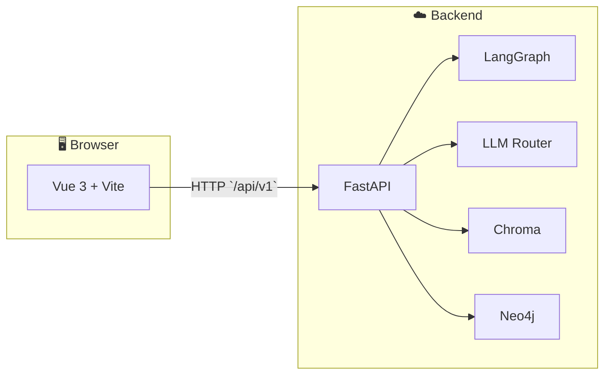

<div align="center">

# ✍️ Writer Copilot

### *Creator Copilot — 技术创作者的 AI 创作副驾驶*

**第二大脑 × 人机协作 × 可度量闭环**：把知识库、图谱、矩阵规划与反馈串进创作流，而不只是一次性对话。*Full-stack monorepo：Vue 3 · FastAPI · LangGraph*

<br/>

[](https://vuejs.org/)
[](https://vitejs.dev/)
[](https://fastapi.tiangolo.com/)
[](https://www.python.org/)
[](https://neo4j.com/)
[](https://www.docker.com/)

<br/>

[](https://github.com/winkovo0818/writer-copilot)
[](#quickstart)
[](requirements.md)

<br/>

[📑 目录](#目录) · [快速开始](#quickstart) · [演示](#demo) · [文档索引](#docs)

</div>

<br/>

---

## 目录

| | |
|:---|:---|
| [Why](#why) | 产品叙事与差异化 |
| [功能全景](#features) | 与前端路由对齐的能力地图 |
| [架构](#architecture) | 请求链路、API 前缀与代理 |
| [技术栈](#tech-stack) | 前后端与基础设施 |
| [仓库结构](#layout) | 目录树与说明文档 |
| [API 一览](#api) | 后端路由模块 |
| [快速开始](#quickstart) | 本地开发 · 测试 · 配置 |
| [Docker](#docker) | Compose 服务与注意事项 |
| [文档索引](#docs) | 需求 / 设计 / 演进文档 |
| [演示与截图](#demo) | 界面演示占位 |
| [Star History](#stars) | 仓库 Star 曲线 |
| [Contributors](#contributors) | 贡献者头像墙 |

---

<a id="why"></a>

## Why · 这款产品解决什么

<table>
<tr>
<td width="50%">

**🎯 愿景**  
打造「**第二大脑 + AI 副驾驶**」：历史文章、概念图谱与内容矩阵共同参与创作，让写作从单次输出变成**可沉淀、可复用、可迭代**的资产。

</td>
<td width="50%">

**⚡ 差异化**  
创作主链路与 **知识库 · 图谱 · 风格进化 · 内容矩阵 · 反馈闭环** 打通，支持长期风格一致与数据驱动优化（详见 [`requirements.md`](requirements.md) 中的 MoSCoW 与里程碑）。

</td>
</tr>
</table>

**典型用户**：技术博主、专栏作者、需要系列化与统一风格的创作者。

---

<a id="features"></a>

## 功能全景

> 主界面为侧边导航 + 多页面工作台，默认进入 **创作工作台**。UI 设计系统见 [`frontend/DESIGN.md`](frontend/DESIGN.md)（ElevenLabs 风格灵感）。

| 路由 | 页面 | 能力侧重 |
|:---:|:---|:---|
| `/editor` | 创作工作台 | 选题 → 大纲 → 正文等人机协作；对接 **LangGraph** 文章图 |
| `/knowledge` | 知识库 | 文章导入、向量检索、知识资产沉淀 |
| `/graph` | 知识图谱 | 概念关系可视化与探索（Neo4j） |
| `/style` | 风格报告 | 风格快照与报告类能力 |
| `/matrix` | 内容矩阵 | 系列规划、进度与矩阵化创作 |
| `/dashboard` | 数据看板 | 统计与运营向视图 |
| `/llm` | LLM 监控 | 模型路由与可观测性 |
| `/settings` | 设置 | 应用与连接配置 |

---

<a id="architecture"></a>

## 架构

<p align="center">
  
</p>

<p align="center">
  <b>可编辑源稿</b>：<a href="docs/assets/system-architecture.excalidraw"><code>docs/assets/system-architecture.excalidraw</code></a>
  · 用 <a href="https://excalidraw.com">Excalidraw</a> 打开即可改布局、配色并导出 PNG / SVG
</p>

<details>
<summary><b>Mermaid 简图（与上图一致）</b></summary>



</details>

| 要点 | 说明 |
|:---|:---|
| **创作主链路** | FastAPI → LangGraph 编译图；启动时注入 **SQLite checkpoint**，支持中断 / 恢复类场景 |
| **API 前缀** | 统一 **`/api/v1`**（`backend/app/config.py` → `api_prefix`） |
| **本地联调** | 前端 **`:5173`** 将 **`/api`** 代理到 **`127.0.0.1:8000`**（`frontend/vite.config.js`） |

---

<a id="tech-stack"></a>

## 技术栈

<details>
<summary><b>前端 · frontend/</b></summary>

| 类别 | 选型 |
|:---|:---|
| 框架 | Vue 3、Vue Router、Pinia |
| 构建 | Vite 6、Sass |
| UI | Ant Design Vue |
| 可视化 | ECharts、D3 |
| HTTP | Axios |

</details>

<details>
<summary><b>后端 · backend/</b></summary>

| 类别 | 选型 |
|:---|:---|
| 框架 | FastAPI |
| 编排 | LangGraph（SQLite checkpoint） |
| ORM | SQLAlchemy 2 异步 · SQLite / 可切换 MySQL |
| 向量 | Chroma |
| 图 | Neo4j（Bolt） |
| LLM | 可插拔（DashScope、Anthropic、Ollama、Mock 等） |
| 调度 | APScheduler（Compose `scheduler` profile） |

</details>

<details>
<summary><b>基础设施</b></summary>

| 组件 | 说明 |
|:---|:---|
| **docker-compose** | 后端、Neo4j、可选 scheduler；数据卷 **`./data`** |
| **OpenAPI** | 开发环境 **`/docs`**、**`/redoc`**（生产可按配置关闭） |

</details>

---

<a id="layout"></a>

## 仓库结构

```
├── backend/              # FastAPI、LangGraph、REST API
├── frontend/             # Vite + Vue 控制台
├── docs/                 # 演进与专题（如 LangGraph）
├── scripts/              # 辅助脚本
├── docker-compose.yml
├── requirements.md       # ⭐ 需求契约与里程碑
├── frontend-tasks.md
├── plan-guid.md
└── tasks.md
```

---

<a id="api"></a>

## API 一览

注册于 `backend/app/main.py`，均带 **`/api/v1`** 前缀：

| 标签 | 模块 | 说明 |
|:---:|:---|:---|
| 创作 | `article` | 文章图与创作接口 |
| 知识库 | `knowledge` | 检索与维护 |
| 知识图谱 | `graph` | 图相关能力 |
| 风格进化 | `style` | 风格分析与报告 |
| 内容矩阵 | `matrix` | 矩阵与规划 |
| 反馈闭环 | `feedback` | 反馈采集与分析 |
| LLM | `llm` | 模型与路由 |

- 健康检查：`GET /health`
- 根信息：`GET /`

---

<a id="quickstart"></a>

## 快速开始

### 环境

- Python **3.11+** · Node.js **18+** · 可选 Docker

### 后端

```bash
cd backend
python -m venv .venv
# Windows PowerShell:
.\.venv\Scripts\Activate.ps1
pip install -r requirements.txt
copy .env.example .env
# 编辑 .env
uvicorn app.main:app --reload --host 127.0.0.1 --port 8000
```

👉 开发环境 OpenAPI：<http://127.0.0.1:8000/docs> · 详见 [`backend/README.md`](backend/README.md)

### 前端

```bash
cd frontend
npm install
npm run dev
```

👉 默认开发地址：<http://127.0.0.1:5173>（`/api` → `8000` 代理已配置）

### 测试

```bash
cd backend && pytest
```

TDD 与验收约定见 [`requirements.md`](requirements.md)。

<details>
<summary><b>⚙️ 配置速查（点击展开）</b></summary>

复制 **`backend/.env.example`** → **`backend/.env`**，常见项：

| 类型 | 变量示例 |
|:---|:---|
| 应用 | `APP_ENV`、`DEBUG` |
| DB / LangGraph | `DATABASE_URL`、`LANGGRAPH_SQLITE_PATH` |
| Chroma / Neo4j | `CHROMA_PATH`、`NEO4J_URI` 与认证 |
| LLM | `DASHSCOPE_API_KEY`、`ANTHROPIC_API_KEY` 等 |
| CORS | `CORS_ORIGINS` |

生产环境请关闭多余文档路由、收紧 CORS 与密钥管理。

</details>

---

<a id="docker"></a>

## Docker

```bash
docker compose up -d
```

| 服务 | 端口 / 说明 |
|:---|:---|
| `backend` | **8000** |
| `neo4j` | 浏览器 **7474** · Bolt **7687** |
| `scheduler` | `docker compose --profile scheduler up -d` |

数据持久化在 **`./data`**（请纳入备份策略）。

> **Note** · `docker-compose.yml` 含前端构建服务；若尚无 **`frontend/Dockerfile`**，请先用本地 `npm run dev`，或补全镜像后再做一体化编排。

---

<a id="docs"></a>

## 文档索引

| 文档 | 内容 |
|:---|:---|
| [`requirements.md`](requirements.md) | 需求契约、MoSCoW、里程碑、风险 |
| [`frontend/DESIGN.md`](frontend/DESIGN.md) | 前端设计系统 |
| [`docs/langgraph-evolution.md`](docs/langgraph-evolution.md) | LangGraph 演进笔记 |
| [`docs/assets/system-architecture.excalidraw`](docs/assets/system-architecture.excalidraw) | 系统架构图（Excalidraw 可编辑源稿） |
| [`docs/assets/architecture-diagram.svg`](docs/assets/architecture-diagram.svg) | 架构图（SVG，README 内嵌用） |
| [`backend/README.md`](backend/README.md) | 后端专项说明 |

---

<a id="demo"></a>

## 演示与截图

> **替换说明**：可将录屏导出为 **GIF**（建议 &lt; 8MB）或 **WebP / PNG** 截图，放入 `docs/assets/` 并改下方路径；亦可用图床链接替换 `src`。

| 创作工作台 · Editor | 知识库 · Knowledge | 内容矩阵 · Matrix |
|:---:|:---:|:---:|
|  |  |  |

---

<a id="stars"></a>

## Star History

[](https://www.star-history.com/#winkovo0818/writer-copilot&Date)

---

<a id="contributors"></a>

## Contributors

感谢每一位贡献者。

<a href="https://github.com/winkovo0818/writer-copilot/graphs/contributors">
  
</a>

---

## 参与贡献

Issue / PR 欢迎。提交前建议跑通 **`pytest`**，并遵守 [`requirements.md`](requirements.md) 中的质量与 TDD 约定。

---

## 许可证

尚未包含 `LICENSE`；对外发布或协作时请按需补充（MIT / Apache-2.0 等）。

---

<div align="center">

<br/>

**如果这个项目对你有帮助，欢迎 Star ⭐**

<sub>Vue 3 · FastAPI · LangGraph · Neo4j</sub>

</div>
