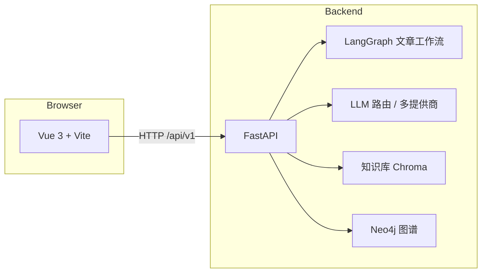

# Writer Copilot（Creator Copilot）

面向技术创作者的 **AI 创作副驾驶**：把知识沉淀、风格一致性、内容矩阵与数据反馈串成闭环，让单篇写作扩展为可复用的创作资产。本仓库为 **全栈 Monorepo**——Vue 3 控制台 + FastAPI 服务，编排层以 **LangGraph** 为核心。

---

## 产品定位与价值

| 维度 | 说明 |
|------|------|
| **愿景** | 打造「第二大脑 + AI 副驾驶」：历史文章、图谱与矩阵规划共同参与创作，而不是一次性对话产出。 |
| **差异化** | 创作流程与 **知识库 / 图谱 / 风格进化 / 内容矩阵 / 反馈闭环** 打通，便于长期迭代与度量。 |
| **典型用户** | 技术博主、专栏作者、需要系列化与风格统一的创作者。 |

更完整的需求契约、优先级（MoSCoW）、里程碑与任务拆解见根目录 **[`requirements.md`](requirements.md)**。

---

## 功能地图（与界面对齐）

前端主应用为侧边导航 + 多页面工作台（默认进入 **创作工作台**）：

| 路由 | 页面 | 能力侧重 |
|------|------|----------|
| `/editor` | 创作工作台 | 选题 → 大纲 → 正文等人机协作创作流（对接 LangGraph 文章图） |
| `/knowledge` | 知识库 | 文章导入、向量检索与知识资产沉淀 |
| `/graph` | 知识图谱 | 概念关系可视化与探索（依赖 Neo4j 等后端能力） |
| `/style` | 风格报告 | 风格快照与报告类能力 |
| `/matrix` | 内容矩阵 | 系列规划、进度与矩阵化创作 |
| `/dashboard` | 数据看板 | 统计与运营向视图 |
| `/llm` | LLM 监控 | 模型调用与路由侧可观测性 |
| `/settings` | 设置 | 应用与连接配置 |

UI 视觉与组件层级详见 **[`frontend/DESIGN.md`](frontend/DESIGN.md)**（ElevenLabs 风格设计系统）。

---

## 架构一览



- **创作主链路**：请求经 FastAPI → LangGraph 编译图（启动时注入 checkpoint），支持中断与恢复类场景（SQLite checkpoint 路径见配置）。
- **API 统一前缀**：`/api/v1`（由 `backend/app/config.py` 中 `api_prefix` 控制）。
- **开发环境**：前端 `5173` 端口将 **`/api` 代理到** `http://127.0.0.1:8000`（见 `frontend/vite.config.js`）。

---

## 技术栈

### 前端 `frontend/`

| 类别 | 选型 |
|------|------|
| 框架 | Vue 3（Composition API）、Vue Router、Pinia |
| 构建 | Vite 6、Sass |
| UI | Ant Design Vue、@ant-design/icons-vue |
| 数据可视化 | ECharts、D3 |
| HTTP | Axios |

### 后端 `backend/`

| 类别 | 选型 |
|------|------|
| 框架 | FastAPI |
| 编排 | LangGraph（文章工作流、SQLite checkpoint） |
| 持久化 | SQLAlchemy 2 异步、SQLite（开发）/ 可切换 MySQL |
| 向量 | Chroma |
| 图数据库 | Neo4j（Bolt） |
| LLM | 可插拔路由（如 DashScope、Anthropic、Ollama、Mock 等，见 `app/llm/`） |
| 任务调度 | APScheduler（可选 Docker profile `scheduler`） |

### 基础设施

| 组件 | 说明 |
|------|------|
| **docker-compose** | 后端镜像、Neo4j、可选 scheduler；数据卷挂载 `./data` |
| **OpenAPI** | 开发环境启用 `/docs`、`/redoc`（生产可按配置关闭） |

---

## 仓库结构

```
├── backend/           # FastAPI 应用、LangGraph、API 路由
├── frontend/          # Vite + Vue 控制台
├── docs/              # 演进/专题文档（如 LangGraph 相关）
├── scripts/           # 辅助脚本
├── docker-compose.yml # 编排与本地依赖
├── requirements.md    # 需求与里程碑（主文档）
├── frontend-tasks.md  # 前端任务拆解
├── plan-guid.md       # 规划类说明
└── tasks.md           # 任务列表
```

---

## 后端 API 模块（标签）

路由注册于 `backend/app/main.py`，均带 **`/api/v1`** 前缀：

| 标签 | 路由模块 | 说明 |
|------|----------|------|
| 创作 | `article` | 文章图、创作相关接口 |
| 知识库 | `knowledge` | 知识检索与维护 |
| 知识图谱 | `graph` | 图查询与相关能力 |
| 风格进化 | `style` | 风格分析与报告 |
| 内容矩阵 | `matrix` | 矩阵与规划类接口 |
| 反馈闭环 | `feedback` | 反馈采集与分析 |
| LLM | `llm` | 模型与路由侧接口 |

健康检查：**`GET /health`**；根路径 **`GET /`** 返回应用名与版本。

---

## 本地开发

### 环境

- Python **3.11+**
- Node.js **18+**
- 可选：Docker（Neo4j、后端容器）

### 后端

```bash
cd backend
python -m venv .venv
# Windows PowerShell:
.\.venv\Scripts\Activate.ps1
pip install -r requirements.txt
copy .env.example .env
# 编辑 .env：数据库、Neo4j、各 LLM Key、CORS 等
uvicorn app.main:app --reload --host 127.0.0.1 --port 8000
```

- 交互式文档（开发）：<http://127.0.0.1:8000/docs>
- 更多后端说明：**[`backend/README.md`](backend/README.md)**

### 前端

```bash
cd frontend
npm install
npm run dev
```

- 开发地址默认：<http://127.0.0.1:5173>
- 浏览器请求 **`/api/*`** 会代理到本机 **8000** 端口，请保持后端已启动。

### 测试（后端）

```bash
cd backend
pytest
```

项目整体遵循 **TDD** 与验收标准，详见 **`requirements.md`** 中「TDD 开发规范」「质量保障体系」等章节。

---

## 配置要点

复制 **`backend/.env.example`** 为 **`backend/.env`**，按环境填写，常见项包括：

- 应用：`APP_ENV`、`DEBUG`
- 数据库与 LangGraph：`DATABASE_URL`、`LANGGRAPH_SQLITE_PATH`
- Chroma / Neo4j：`CHROMA_PATH`、`NEO4J_URI`、认证信息
- LLM：`DASHSCOPE_API_KEY`、`ANTHROPIC_API_KEY` 等（以示例文件为准）
- CORS：`CORS_ORIGINS`（前端开发源）

生产环境请关闭不必要的文档路由，并收紧 CORS 与密钥管理。

---

## Docker

在**仓库根目录**执行：

```bash
docker compose up -d
```

| 服务 | 说明 |
|------|------|
| `backend` | 后端 API，端口 **8000** |
| `neo4j` | 图数据库，浏览器 **7474** / Bolt **7687** |
| `scheduler` | 可选：`docker compose --profile scheduler up -d` |

数据目录通过卷映射到 **`./data`**（含日志、Neo4j 数据等，请纳入备份策略）。

> **说明**：`docker-compose.yml` 中含 **前端** 构建目标；若仓库中尚未提供 **`frontend/Dockerfile`**，请先用上文「本地开发」运行前端，或自行补全镜像后再做一体化编排。

---

## 文档索引

| 文档 | 内容 |
|------|------|
| [`requirements.md`](requirements.md) | 需求契约、功能全景、非功能、里程碑与风险 |
| [`frontend/DESIGN.md`](frontend/DESIGN.md) | 前端设计系统与视觉规范 |
| [`docs/langgraph-evolution.md`](docs/langgraph-evolution.md) | LangGraph 演进相关笔记 |
| [`backend/README.md`](backend/README.md) | 后端专项说明 |

---

## 许可证

尚未包含 `LICENSE` 文件；若对外发布或协作，请按需补充（如 MIT、Apache-2.0 等）。
